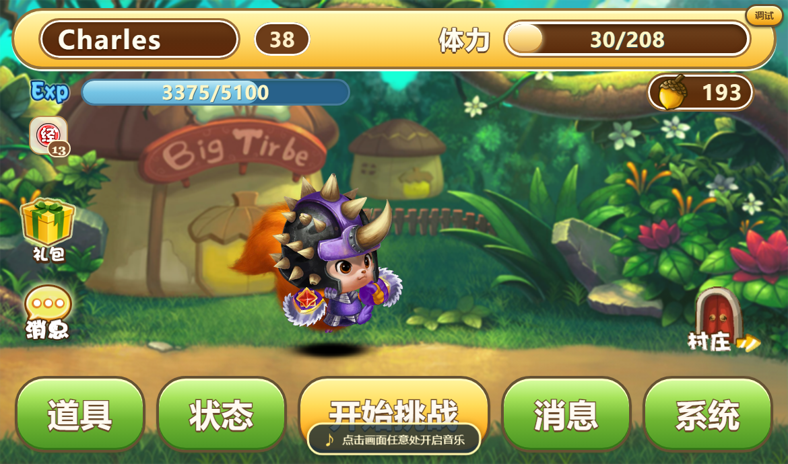

# 松鼠大战 · 怀旧单机复刻版

12年 UC 乐园中**松鼠大战**游戏玩法重做为**纯静态网页**的单机复刻：三侠闯关、背包装备、
装备融合、竞技场天梯、师徒好友、挑战塔与无尽塔。没有构建步骤，双击启动器就能玩；
存档写本地文件，同时支持 Mac ↔ Windows 双机同步。

## 游戏画面

| 标题画面 | 主界面 |
|---|---|
|  |  |

| 战斗 | 无尽挑战塔 |
|---|---|
|  |  |

## 安装与启动

> 三条路：
**① 在线试玩**（不安装）
**② Windows / macOS 便携包或安装包**
**③ 安卓 APK**。
> 存档全部留在本地，不上传任何服务器。

### ① 在线试玩（不安装）

浏览器打开 GitHub Pages 地址即可（仓库 Settings → Pages 选 “GitHub Actions”，推 main 自动部署）。
存档落在浏览器 localStorage，换浏览器或清缓存会丢，适合先试玩。

### ② Windows

| 方式 | 安装 / 运行步骤 |
|---|---|
| **便携包（推荐）** | 到 GitHub Releases 下载 `squirrel-web-win.zip` → 解压到任意目录（别放只读目录）→ 双击 `scripts\启动游戏.cmd`。根目录有 `squirrel_fight.exe` 时会直接开原生窗口 |
| **安装包** | 下载 `*.exe`（NSIS）或 `*.msi` 双击安装 → 从开始菜单 / 桌面图标启动。需要系统自带 **WebView2**（Win11 自带，Win10 正常更新的机器一般也有） |
| 直接用仓库里的 exe | 双击根目录 `squirrel_fight.exe`（免安装，但 `js/` `images/` 等素材要和它同目录） |

启动脚本（`scripts\启动游戏.cmd` + `scripts\start-game.ps1`，用于「还没编译 exe / 没有 WebView2 / 想强制走浏览器 / 只读模式」）：

```
scripts\启动游戏.cmd                 # 找不到 exe 时退回「本地服务器 + 浏览器应用窗口」
scripts\启动游戏.cmd --browser       # 强制走浏览器路线
scripts\启动游戏.cmd 8081 --no-save  # 换端口 + 只读（不写存档）
scripts\启动游戏.cmd --stop          # 停掉后台的本地服务器
```

启动顺序：**先找 `squirrel_fight.exe`**（根目录 → `scripts\` → `src-tauri\dist\` → `src-tauri\target\release\`），
找到就开原生窗口；没有或连开三次都没稳住，才退回「本地服务器 + 浏览器应用窗口」。

### ③ macOS

| 方式 | 安装 / 运行步骤 |
|---|---|
| **便携包（推荐）** | 下载 `squirrel-web-mac.zip` → 解压 → 双击 `scripts/启动游戏.command`（停止：`bash scripts/启动游戏.command --stop`） |
| **安装包** | 下载 `*.dmg` → 拖进「应用程序」→ **首次打开请右键（或按住 Control 点）→ 打开**：本项目未做代码签名 / 公证，直接双击会被 Gatekeeper 拦下 |
| 打不开时 | 若提示「已损坏」或「无法验证开发者」：`xattr -dr com.apple.quarantine <游戏目录或 .app>`，然后再右键 → 打开 |

### ④ 安卓（APK）

1. **拿 APK**：CI 不产出安卓包，需要本地打 —— `pwsh -File tools\build-apk.ps1 -Abi arm64-v8a -Release`
   （真机）/ `-Abi x86_64`（模拟器），产物在 `src-tauri\dist\ssdz-classic-<abi>-<profile>-<日期>.apk`；
   也可以直接用维护者分享的 APK。
2. **装**：把 APK 传到手机（数据线 / 微信文件 / 网盘）→ 在文件管理器里点开 → 按提示到系统设置里
   允许该来源「安装未知应用」→ 继续安装。
3. 安装时若提示「来源不明 / 未经认证」是正常的：现在用的是 **debug 签名**（自用没问题；
   要长期给别人的手机装，需要自己配 release 签名后重打）。
4. 手机存档在应用私有目录 `/data/user/0/com.ssdz.classic/save/progress.json`，与电脑同一份格式 ——
   用游戏里「系统 → 导入/导出存档」互传。

⚠️ Windows 的 `squirrel_fight.exe`（PE 格式 + Windows API）**不能**装到安卓上，安卓必须用 APK；
反过来 APK 也不能在 Windows 上跑。构建命令与踩坑见 [docs/更新记录.md](docs/更新记录.md) 的「文档收敛」一条，以及 `tools/build-apk.ps1` 头部注释。

### ⑤ 从源码运行（可选）

```bash
node scripts/serve.js     # 起本地静态服务器（带存档接口）
# 浏览器打开 http://127.0.0.1:8080/
```

游戏本体是纯静态的、没有构建步骤；只有桌面壳 / 安卓壳需要编译（见下面「开发」）。

### 存档位置

| 场景 | 存档文件 |
|---|---|
| 便携包 / 源码运行 | 游戏目录 `save/progress.json` |
| Windows 安装版 | `%APPDATA%\com.ssdz.classic\save\progress.json` |
| macOS 安装版 | `~/Library/Application Support/com.ssdz.classic/save/progress.json` |
| 安卓 | `/data/user/0/com.ssdz.classic/save/progress.json` |
| 在线试玩 | 浏览器 localStorage（换浏览器 / 清缓存会丢） |

磁盘优先、localStorage 只是兜底；启动时会自动体检存档，损坏就从 `save/backup/` 恢复快照，
两处同时有存档时按 `savedAt` 取较新的那份。

## 玩法

- **关卡**：18 关推进，每关三名对手 + 关底 Boss。
- **战斗**：经典 1170×690 画布；普攻 / 技能 / 道具，暴击、闪避、吸血、反伤、
  护盾、中毒、复活等机制。实战与离线模拟共用同一套规则。
- **成长**：升级给属性点与礼包，武器 / 技能三选一，经验丸与属性丸等道具。
- **背包与装备**：部位 × 品质（普通 → 稀有 → 史诗 → 传奇），强化、镶嵌、天赋与武技。
- **装备融合**：同部位同品质三件合成更高品质一件。
- **竞技场与天梯**：经验场、碎片场、天梯赛（积分 / 金杯 / 周榜）。
- **师徒与好友**：拜师收徒领贡品，好友切磋与随机挑战。
- **挑战塔**：**相对原版新增模式**；类似于不封顶的关卡；每层一张挑战书，连战只继承血量，第三场后三选一增益。
- **无尽挑战塔**：**相对原版新增模式**；免门票；rougelike无尽模式；通过组合限次/永久/即时三类增益，增强自身并挑战越来越强大的敌人，获取更高的分数与抽奖卷。
- **双机同步**：Mac ↔ Windows 通过 ZeroTier 互推存档与游戏文件（`scripts/一键同步`）。
- **完全免费**：没有内购、没有广告；「系统」页最上方有一个**自愿支持作者**的入口（爱发电），升到 30 级时也会提示一次 —— 打赏不换取任何游戏内好处，不影响内容与平衡。

## 更新记录

各版本的改动都写在 git 提交历史里（`git log`）；设计与数值细节见 [docs/](docs/) 目录。

## 开发

纯静态：游戏本体没有构建步骤（`css`/`js`/`images`/`audio` 直接就是运行时产物），
只有桌面壳与安卓壳需要编译。

### 目录结构

| 目录 / 文件 | 作用 | 主要内容 |
|---|---|---|
| `scripts/` | **运行入口与本地服务器**（双击启动、存档接口都在这） | `index.html` 首页（服务器把它映射成 `/`）、`serve.js` / `serve.py` 静态服务器（带 `/__save` 存档接口与 `/__update` 一键更新接口）、`update-game.js`（一键拉取远端更新的执行体：git pull / GitHub 便携包 / 安装包，零依赖）、`启动游戏.command`（macOS 双击入口）、`启动游戏.cmd` + `start-game.ps1`（Windows 兜底入口）、`停止游戏.command`、`一键同步.command` / `一键同步.cmd`、`重启同步服务.cmd`、`cleanup-old-layout.*`（一次性整理旧布局）、`sync/` 双机同步本体、`.gitattributes`（本目录的换行符规则：bash 脚本 LF、`.cmd` CRLF） |
| `js/` | **全部游戏代码**（见下表逐文件说明） | 启动流程、存档、战斗、塔、界面、静态数据 |
| `css/` | 样式，按模块分文件 | `style.css`（基础）、`classic*.css`（复古界面）、`tower.css`（塔）、`battle-drops.css`、`debug.css` |
| `images/` | 图片素材 | 背景与场景、UI 图标、角色图集（`images/orig/` 原版图集）、`screenshots/`（README 用的截图） |
| `audio/` | 音效与 BGM | 战斗音效、主界面 BGM |
| `src-tauri/` | **桌面壳与安卓壳**（Rust + Tauri 2，同一个 crate 出 exe 和 apk） | `src/lib.rs`（全部逻辑，按 `cfg(mobile)` 分支）、`src/main.rs`（桌面入口，仅 8 行）、`Cargo.toml`、`tauri.conf.json`、`tauri.android.conf.json`（安卓构建时自动合并）、`icons/`、`app-icon.png`、`gen/android/`（`tauri android init` 生成的安卓工程，**不进仓库**）、`web/` 与 `dist/`（构建产物） |
| `tools/` | **开发与验证工具**（不参与运行） | 20 个 `test-*.cjs` 主题套件（一条用例对应一条规则；新用例放进主题相符的套件）+ `test-battle.js`（动画/图集）、`check-asset-paths.cjs`（资源路径体检）、`build-tauri-app.cjs`（桌面 exe / 安装包）、`build-tauri-web.cjs`（打包前暂存前端）、`build-apk.ps1`（安卓 APK）、`gen-vendor-data.cjs`（重新生成 `js/gamedict.js`）、`stage-balance.cjs`（关卡数值，被回归调用）、`publish-guide.md` / `tauri-guide.md`（发布与桌面壳指南） |
| `docs/` | 说明文档（**新增需用户同意**，见 `docs/AGENTS.md`） | [更新记录](docs/更新记录.md)（唯一变更日志，最新在上）、[真化武器与技能数值](docs/真化武器与技能数值.md)（平衡对照表）、[双语与本地化方案](docs/双语与本地化方案.md)（未落地方案） |
| `save/` | **运行时的存档目录**（不进仓库） | `progress.json` 正式存档、`backup/` 快照、`server.out.log` / `server.err.log` |
| `references/` | 原版 APK 与参考素材（本地，不进仓库） | 只作对照/取证，游戏运行不读它 |
| `out/` | AI 超分与开发期对比图的**临时工作区**（本地，不进仓库） | 实验对比图与分析脚本；删掉不影响游戏 |
| `.github/` | CI 与发布 | `ci.yml`（回归）、`pages.yml`（在线试玩版）、`release.yml`（双平台便携 zip）、`tauri.yml`（桌面/移动安装包） |

根目录只有五样：`squirrel_fight.exe`（Windows 免安装入口）、`README.md`、`LICENSE`（许可协议）、
`version.json`（版本标识，游戏内「游戏更新」拿它和远端 tag 对比）、`.gitignore`（哪些本地产物不进仓库）。
换行符规则放在 `scripts/.gitattributes`（`.gitattributes` 与 `.gitignore` 一样按目录生效，
所以只作用于 `scripts/`）——bash 脚本必须 LF，否则 mac 上双击会报
`syntax error near unexpected token '$'do\r''`。


测试（Node 直接跑，无依赖）：

```bash
node tools/test-state.cjs        # 存档与属性
node tools/test-tower-plan.cjs   # 塔规则
node tools/test-ui-flow.cjs      # 界面流程
# ……tools/ 下共十余个套件，全绿为准
```

调试面板：游戏内 `Ctrl+Shift+D`（不影响正式存档）。

## 许可

本项目是《松鼠大战》（UC 乐园）的**非商业同人复刻**：与原作者 / 原厂商无隶属或授权关系，
作者不做任何商业行为，原作素材（名称、角色、美术、音频、原始数值数据）版权归原厂商所有，
将在权利人要求时立即下架或调整。

作者独立设计并实现的部分（复刻代码、新增玩法设计、数值表、文档与工具）© 2026 Charlespkuer：
**允许**个人非商业使用、修改与免费分享（保留署名与本协议）；
**未经书面授权，禁止**任何商业使用，也禁止把它作为商用素材 / 模板分发。

完整条款见 [LICENSE](LICENSE)；商业授权或权利异议请通过 Issue 联系作者。
「自愿支持作者」（爱发电）只是玩家对作者个人的打赏，**不换取任何游戏内好处**，不构成本项目的商业使用；
具体实现见 `js/main.js` 的 `Main.SUPPORT` / `openExternal`，要点见 [docs/更新记录.md](docs/更新记录.md)。
