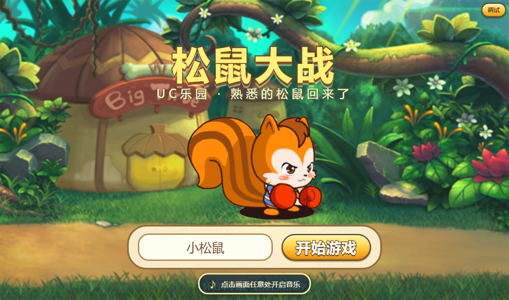
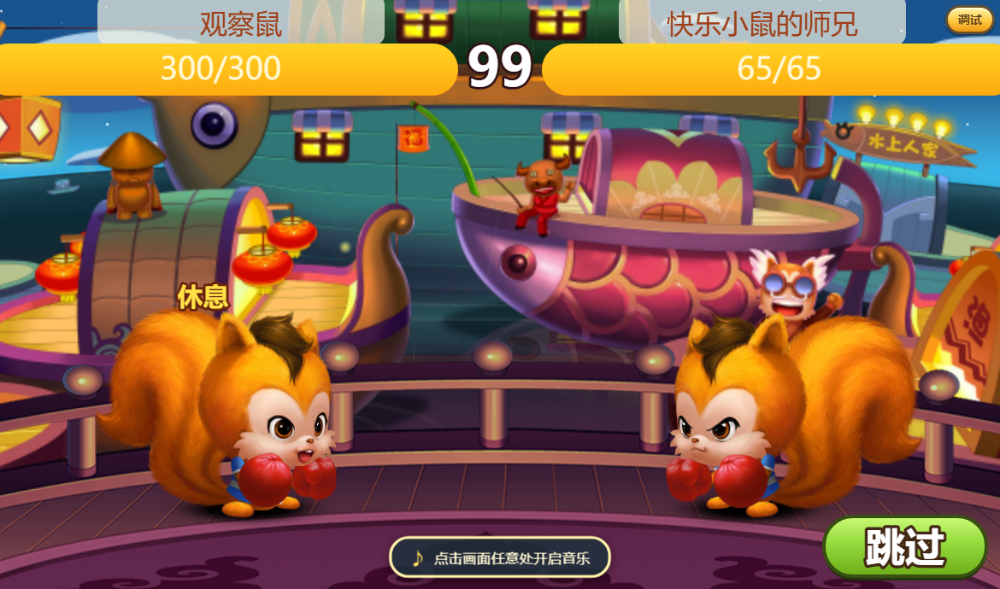

# 松鼠大战 · 怀旧单机复刻版

把当年 UC 乐园《松鼠大战》的玩法做成**纯静态网页**的单机复刻：三侠闯关、背包装备、
装备融合、竞技场天梯、师徒好友、挑战塔与无尽塔。没有构建步骤，双击启动器就能玩；
存档写本地文件，也支持 Mac ↔ Windows 双机同步。

## 游戏画面

| 标题画面 | 主界面 |
|---|---|
|  |  |

| 战斗 | 无尽挑战塔 |
|---|---|
|  |  |

## 启动

| 平台 | 方式 |
|---|---|
| macOS | 双击 `启动游戏.command`（停止：`bash 启动游戏.command --stop`） |
| Windows | 双击 `启动游戏.cmd` |
| 手动 | `node scripts/serve.js` → 浏览器打开 `http://127.0.0.1:8080/` |

存档默认写在 `save/progress.json`（磁盘优先，浏览器 localStorage 只是兜底）；
启动时会自动体检存档，损坏时从 `save/backup/` 恢复快照。
直接静态托管也能玩，但存档只留在浏览器里，双机同步不可用。

## 玩法

- **关卡**：18 关推进，每关三名对手 + 关底 Boss。
- **战斗**：经典 1170×690 画布；普攻 / 技能 / 道具，暴击、闪避、吸血、反伤、
  护盾、中毒、复活等机制。实战与离线模拟共用同一套规则。
- **成长**：升级给属性点与礼包，武器 / 技能三选一，经验丸与属性丸等道具。
- **背包与装备**：部位 × 品质（普通 → 稀有 → 史诗 → 传奇），强化、镶嵌、天赋与武技。
- **装备融合**：同部位同品质三件合成更高品质一件。
- **竞技场与天梯**：经验场、碎片场、天梯赛（积分 / 金杯 / 周榜）。
- **师徒与好友**：拜师收徒领贡品，好友切磋与随机挑战。
- **挑战塔**：每层一张挑战书，连战只继承血量，层间三选一增益。
- **无尽挑战塔**：免门票从 1 层冲分；限次 / 永久 / 即时三类增益、段位轮转机制、
  每 5 层试炼商店、每 10 层里程碑奖励，随时可结算离场。
- **双机同步**：Mac ↔ Windows 通过 ZeroTier 互推存档与游戏文件（`scripts/一键同步`）。

## 修 Bug：战斗播不了（模块加载期 ReferenceError）（2026-10）

上一轮修 C57 显示时，我把 `applyRoundCaps` 写在了 `Battle.run` **内部**，却又在模块作用域
的 `window.Battle = { … }` 里导出它 → `js/battle.js` 一加载就 `ReferenceError: applyRoundCaps is not defined`
→ `window.Battle` 根本没挂上 →「战斗完全播不了」。

修法：把 `applyRoundCaps` 挪到模块作用域（它本来就是纯函数），`run` 内部照常调用，导出不变。

**顺带补了一条守卫**：`tools/test-min-deps.cjs` 新增「浏览器侧模块都能加载并挂上全局 ——
sim / tower-data / state / tower / battle / battle-drops / ui / classic-ui / classic-extras /
classic-fusion / tower-ui」，在一个极简 DOM 桩里逐个 `runInContext`，并断言
`window.Battle.run` / `Tower.endlessInfo` / `TowerData.BUFFS` / `TowerUI.openEndless` / `Sim.simulate` 都在。
这条守卫**已验证能抓住本次这个 bug**（临时把函数挪回 `run` 内部 → 立刻报
「js/battle.js 加载失败：applyRoundCaps is not defined」）。
之所以之前 20 个工具全绿却没发现，就是因为没有任何一个工具加载过 `js/battle.js`。

## 修 Bug：玉石俱焚「血量上限没有变化」看不到（2026-10）

现象：装了 C57 之后战斗里看不到血量上限变化（用户报的）。

排查：模型层其实是生效的 —— 真实路径（`nextBattle` → `adjustMe` → `Sim.simulate`）
里 `me.mods.roundMaxHpMul = 0.9`、双方 `maxHp` 每回合 `floor(×0.9)` 一路缩、
回合里也有「玉石俱焚」的结算行。问题在**显示**：

- `Sim` 只把「当前血量」通过 `hpAfter` 交给战斗回放，**上限变化从来没传出去**；
- 回放的血条上限 `maxHp[]` 是开战时的固定值 → 画出来的永远是 `x/初始上限`。

修法：
- `Sim` 在「玉石俱焚」那一回合里带上 `maxHp: [我, 敌]` 与 `hp: [我, 敌]`；
- 回放新增纯函数 `applyRoundCaps(maxHpArr, hpsArr, r)`（`Battle._applyRoundCaps` 供单测）
  把这个 payload 应用到血条数组上，并在真的压低时两侧各飘一次「上限 N」。

验证：真实浏览器里打一场（开无敌模式跑满）—— `Sim` 侧记录到
**11 次「玉石俱焚」结算，敌方上限 536 → 165、我方 40 → 9**，第一次结算 `[36, 482]` ✓。
（战斗回放本体依赖 rAF 逐帧推进，headless 里驱动不到末帧，所以这部分用纯函数单测锁住。）

## 玉石俱焚（C57）：两座塔两套口径（2026-10）

同一个限次类在两座塔里的读法不一样，所以说明文案也分两套：

| | 挑战塔 | 无尽塔 |
|---|---|---|
| 口径 | 「下一场战斗」（那里一场就是一层） | 「限次 10 场」+ 当前剩余次数 |
| 文案 | `desc`（含「下一场战斗…」） | `descEndless`（「限次 10 场：每场战斗中…」） |
| 卡片/悬停 | 「挑战塔 · 下一场战斗」 | 「限次 10 场」· 角标「无尽塔 · 剩 N 场」· 悬停写剩余场次 |

- 数据侧新增可选字段 `descEndless`，配套 `TowerData.descOf(buff, mode)`（不传 mode 用默认 `desc`）。
- 界面侧 `isTowerNext(b, mode)` 变成模式感知：只有**挑战塔**才把 `nextBattle` 当「下一场」口径，
  无尽塔照常按限次显示剩余次数。面板/商店/集锦/获得提示都改走 `descOf`。
- 顺手修了一处潜在坑：`choices.map(choiceCard)` 会把数组当第三个参数塞进 `mode`，
  导致卡片口径全判成无尽塔 —— 已改成显式传 mode。

## 无尽塔右上角标注「本场战斗获得多少试炼币」（2026-10）

- `reportBattle` 在每场开始时把 `run.lastCoinsGained` 清零，赢了再由战利品结算写回
  **本场真实增量**（基础 `COINS.battle` × 战利品加成，击败精英再加 `COINS.elite`）；
  输掉的那一场自然显示 0，不会留着上一场的数字。返回值也带 `out.coinsGained`。
- `endlessInfo().run` 白名单里补上这个字段（它是拷贝，漏了界面就读不到 —— 本轮就是这么踩到的）。
- 无尽塔主界面右上角的「试炼币」旁边多一个绿色 **+N** 增量（`.currency-delta`），
  悬停写明「上一场战斗获得 N 枚（基础 8，含战利品加成；击败精英另有 +15）」。
  下一场战斗会把它刷新成新一场的增量。

## 道具卖出：弹窗式「返回 / 卖出」，点一下卖 1 个（2026-10）

背包一级界面原来点「卖出」会弹一个**滑动条选数量**的确认窗。现在跟「使用」同一套交互：

- 按钮文案就是「**卖出**」，点它**打开卖出弹窗**（标题「卖出道具」）；
- 弹窗按钮：**左下「返回」、右下「卖出」**（沿用 modal 的角色排序：muted 最左、primary 最右），
  弹窗里没有滑动条、不选数量；
- 点一下「卖出」= **卖 1 个**（按原回收价进账、照常计入每日任务），
  **弹窗不关、数字实时刷新**，可以一直点；卖光后按钮自动禁用；
- 弹窗正文只有「每个可回收 X 金松果 / 拥有 N 个 / 金松果 M」，**不再有那行操作提示**；
  另外把「使用」弹窗体力标签里的「硬上限 999」也去掉了（满体力时的提示改成「体力已经满了」）；
- 点「返回」（或右上角 ×）关掉弹窗时，背包会按最新数量**原地重绘**（页码与选中道具保持）；
- 旧的 `sellAsk`（滑动条 + 「确认卖出 ×N」）连同 `sell-count` 滑块整块删掉；
  `fillRange` / `.setting-slider` 仍留给设置页的音乐音量用。

## 新增 6 个增益（2026-10，默认仅无尽塔）

| id | 稀有度 | 名称 | 效果 | 归属 |
|---|---|---|---|---|
| C54 | 史诗·永久·**可叠 2 层** | 越战越勇 | 战斗中每回合开始 力/敏/速 各 +1.5%（×层数），每场战斗结束清零 | **挑战塔 + 无尽塔** |
| C55 | 传奇·永久 | 后发制人 | 每回合把「落后对手最多」的那一项补上差距的 10%，每场战斗结束清零 | 仅无尽塔 |
| C56 | 稀有·永久 | 风影身法 | 每场战斗中第一次被攻击必定闪避 | 仅无尽塔 |
| C57 | 史诗·限次 10 | 玉石俱焚 | 每回合开始双方生命上限各 ×90%（向下取整），每场战斗结束清零 | **挑战塔 + 无尽塔** |
| C58 | 史诗·永久 | 豪掷千金 | 每在试炼商店消费 100 试炼币，立即获得 1 个随机限次增益 | 仅无尽塔 |
| C59 | 史诗·永久·**可叠 3 层** | 门庭若市 | 每进入一次试炼商店，立即获得 100 试炼币（×层数） | 仅无尽塔 |
| E12 | 史诗·即时·**一局一次** | 时来运转 | 商店刷新「每花 10 试炼币带来的稀有度提升」**翻倍** | **仅商店出售**（无尽塔） |

实现要点：

- 前四条的「每回合」= **该角色的每次出手开始**（与「活血丹」「浴血重生」同一口径）；
  加成写在战斗体的 `buffFlat` / `maxHp` 上，而战斗体是 `Sim.simulate()` 里新建的，
  所以「每场战斗结束时加成消失」天然成立，不需要额外清理。
  「越战越勇」按**基础值 ×1.5% ×层数**逐回合累加；「玉石俱焚」每次都 `floor(上限 ×0.9)`
  并把当前血量裁到新上限，双方一起缩。
- C58 / C59 走无尽塔的经济钩子：C58 与「挥金如土」各自独立累计
  （`run.shopSpendLimited` / `run.shopSpend`），达标立刻 `addBuff` 一个随机限次增益，
  池子空了就停手、不空转进度；C59 在 `makeShop()` 里发放（5 层结算点 / 立即进货 /
  休整商店 / 立即开店四条进店路径都算），商店对象带 `enterCoins` 供界面飘字。
- **E12「时来运转」= 天命所归（C51）的下位**：史诗·即时·一局一次，
  标签是 `endless + shop + oncePerRun`（**故意不带 `battle`** → 不进战斗奖励池，
  只能在商店买到 —— 这是标签系统里第一条「仅商店」的增益）。
  效果走 `tiltRateMul(run)`：持有它时 `rerollTilt(paid)` 按 `paid × 2` 计算，
  也就是「同样的钱换来两倍的稀有度倾斜」；只作用于商店刷新
  （`rollShopSlots` / `rerollExpectation`，界面提示里会标出「时来运转：提速 ×2」），
  场间三选一的倾斜不受影响。
- 6 条都按新标签系统登记：C54/C57 带 `tower`（挑战塔保留），其余只有 `endless`；
  可叠层的两条带 `stackable`；C57 带 `limited` + `nextBattle`（限次文案口径）。
  四个新 mod 键（`roundStatPct` / `catchUpPct` / `roundMaxHpMul` / `firstDodge`）
  都补进了 `aggregate()` 的白名单 —— 漏了这一步它们根本进不了战斗。

## 改名：「重新挑战币」→「铸币」（2026-10）

- 游戏内文案统一改成 **铸币**（旧写法「重新挑战币」与简写「重挑币」全部替换，
  共 71 处，覆盖无尽塔界面、商店货架、E09/E10 增益文案、文档与测试）。
- **无尽塔主界面右上角新增「铸币」一项**，直接标出**本场拥有多少枚**；
  悬停说明：失败时花 1 枚回滚本场再打一次 / 退出本局时 1:1 折成抽奖卷 /
  试炼商店左下角 50 试炼币买 1 枚。
- 内部字段名沿用 `retryToken`（存档里的 `run.retryToken`、`SHOP.retryPrice`、
  `mods.instantRetry` 都没变）—— 只改游戏内叫法，避免旧档迁移。

## 修 Bug：E01「立即进货」关掉之后仍然每场开店（2026-10）

`E01 立即进货` 的效果原来是**拿到那一刻写死**在 `run.postBattleShop` / `run.shopDiscount`
上的，而限次增益的「开关」（`limited[].on`）只在 `eachBuff` 聚合时才被尊重 ——
于是玩家把 E01 关掉之后，缓存还在，**每场战斗结束照旧进商店**。

改成**按「现在开着的 E01」现算**：

- 新增 `activeShopCredit(run)`：只看 `on !== false` 且 `uses > 0` 的立即进货条目；
- 战后判定在**扣限次之前**取这份折扣（E01 的限次就消耗在这一场，扣完条目会被移除）；
- `makeShop(run, e01Pct)` 把「即时折扣券（steam大促 E04 −30%）」与「E01 当前这一份
  （−50%）」在**开店那一刻**合并（两者同时生效 → −65% = 3.5 折，谁先拿都一样）；
- `run.postBattleShop` 缓存字段彻底删除（旧档在 `normalizeRun` 里清掉），
  E01 关闭时不再开店、也不消耗次数（与「关掉不扣次数」的口径一致）。

`tools/test-fixes-round.cjs` 的「需求15」加了回归：关掉后连续几场都不开店、重开恢复生效且只开一次、
E01+E04 合并仍是 3.5 折。

## 本轮改动（2026-10）

**① 随机挑战经验下调 + 等级差增幅收窄**
同级基准 `20 + 等级×0.65` → **`16 + 等级×0.55`**（20 级：33 → 27，−18%）；
等级差线性 `+14%/级 / 压实 0.88` → **`+9%/级 / 压实 0.78`**，
同样越 3 级：倍率 1.36 → **1.22**、经验 45 → 33（−27%）。
竞技场保持不动（4 人两轮、要赢才拿满，单位体力看期望仍与随机挑战同档）。

**② 道具界面按钮顺序**：背包一级界面的「卖出」挪到「使用/合成」**左边**
（主操作仍是最醒目的金色按钮）。

**③ 增益标签系统（严格池子管理）**：每条增益显式写 `tags: [...]`，
池子只认标签 —— 挑战塔只出 `tower`、无尽塔只出 `endless`（增益集锦也不再出现挑战塔专属）、
战斗掉落只出 `battle`、商店只卖 `shop`；可叠层 / 每局限次获得 / 同名唯一 / 隐藏
也都有独立标签。
**旧的布尔字段（towerOnly / endlessOnly / battleOnly / shopBanned / stackable /
repeatable / unique / nextBattle / hidden）已全部删除**，数据里再写就是加载期报错 ——
代码与测试一律读标签。加载期校验 + `tools/test-buff-tags.cjs`（含反向用例：
喂坏数据、或把旧字段写回去，都必须抛错）。
顺带把 **C36「挥金如土」**（试炼商店消费）改成无尽塔专属。
细节见 [docs/无尽挑战塔系统设计文档.md](docs/无尽挑战塔系统设计文档.md) 的 3.5 节。

## 开发

纯静态、无构建步骤。`js/` 是全部游戏代码：

| 文件 | 职责 |
|---|---|
| `main.js` | 启动流程、标题 / 主界面场景、存档告警 |
| `state.js` | 存档读写、属性、关卡进度、背包 |
| `engine.js` / `sim.js` | 战斗引擎 / 离线战斗模拟（共用规则） |
| `battle.js` / `battle-drops.js` | 战斗表现 / 掉落 |
| `tower.js` / `tower-data.js` / `tower-ui.js` | 挑战塔 + 无尽塔：规则 / 数值 / 界面 |
| `classic-ui.js` / `classic-extras.js` / `classic-fusion.js` | 复古界面：主框架 / 周边系统 / 装备融合 |
| `gamedata.js` / `gamedict.js` | 静态数据（`gamedict.js` 由脚本生成，勿手改） |
| `ui.js` | 通用 UI 组件 |

测试（Node 直接跑，无依赖）：

```bash
node tools/test-state.cjs        # 存档与属性
node tools/test-tower-plan.cjs   # 塔规则
node tools/test-ui-flow.cjs      # 界面流程
# ……tools/ 下共十余个套件，全绿为准
```

调试面板：游戏内 `Ctrl+Shift+D`（不影响正式存档）。

## 许可

仅供怀旧与学习交流，素材版权归原厂商所有。
