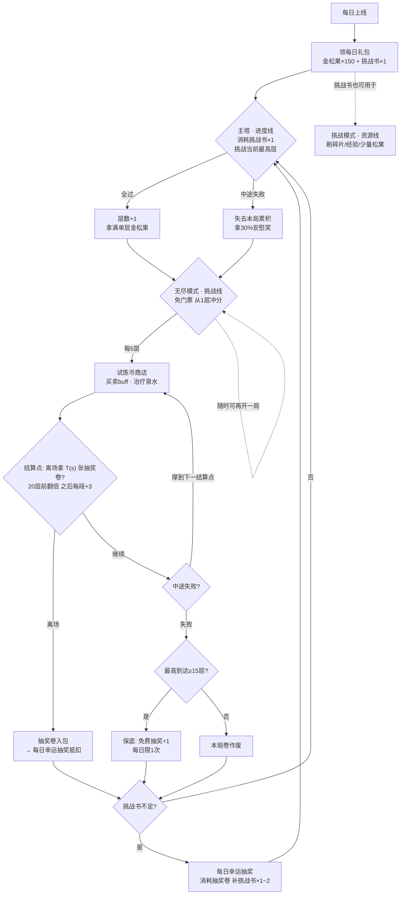
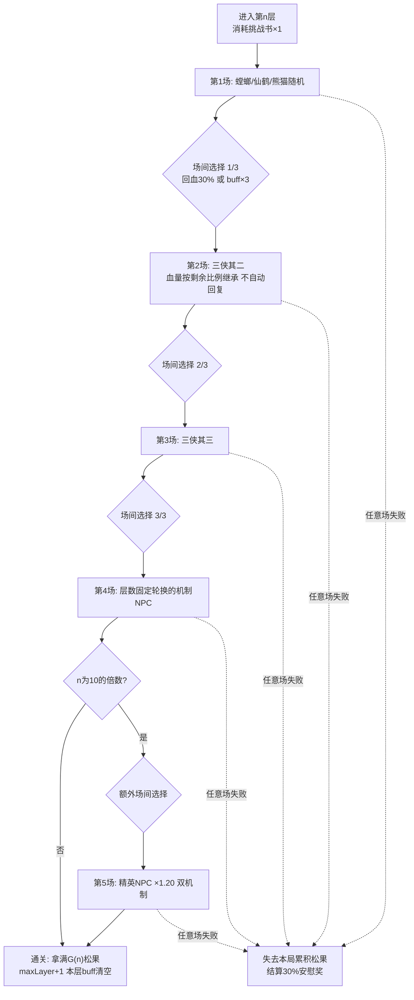
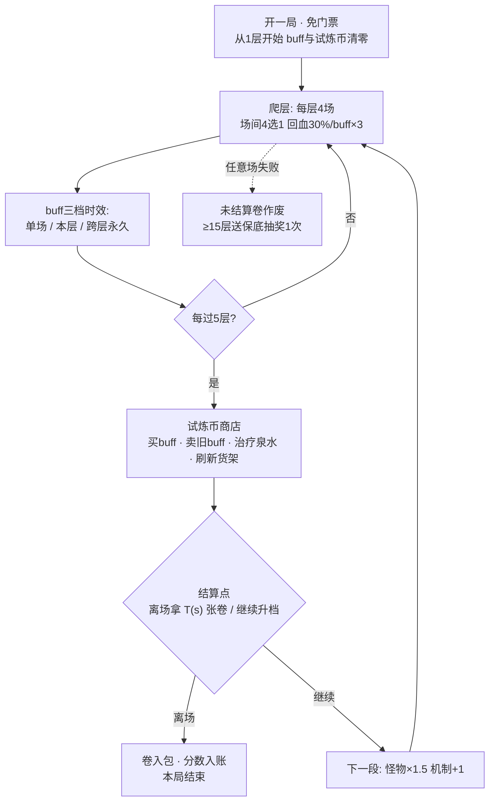
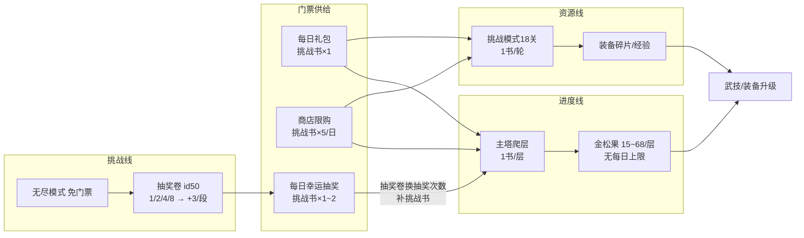

# 无尽挑战塔 · 终局玩法系统设计文档

> 项目：《UC松鼠大战》怀旧版
> 版本：v2.2（2026-09-27，体验修订：第 4 场改松鼠对手、高血低攻、塔内倍速、UI 对齐经典界面）
> 定位：30 级后的终局内容，承接挑战模式（螳螂/仙鹤/熊猫）通关后的玩家。
> 本文档所有数值均已与现有代码模型（`js/gamedata.js` 关卡强度模型、`js/sim.js` 战斗模拟器、`js/state.js` 经济系统）对齐，可直接作为开发依据。

## v2.2 体验修订（2026-09-27）

| 改动 | 说明 |
|---|---|
| **第 4 场改成松鼠对手** | 原来第 4 场的 10 个机制 NPC 用螳螂/仙鹤/熊猫动画表，等于三侠换皮。改成同族**松鼠**：贴图走玩家那套 `SQ` 表、武器技能取自松鼠本来的池子、出招是**固定循环**（可背板）。3 套模板（斥候/铁壁/狂暴）三层一循环。机制 NPC 退到 x10 层精英场，轮换扩到全部 10 个——否则后排 4 个 NPC 永远打不到。详见 1.7。 |
| **敌方改成「高血低攻」** | 1.4 的 `0.66 / 0.85` 拆成三个可调系数（`tower-data.js`：`FOE_STAT_MUL 0.66` / `FOE_POWER_MUL 0.52 → 见下一行` / `FOE_HP_MUL 1.06`）。只压**力量**（×0.79），敏捷/速度不动——后两者影响闪避与出手次数，属手感维度。总承伤 ≈ 不变（血 ×1.25 × 力 ×0.79 ≈ 1.0），但每场更长、更吃续航，和玩家堆爆发的 build 形成反差。 |
| **敌方力量再压一档（0.52 → 0.47）** | 出手改成「优先用本场没用过的武器/技能」后玩家整体输出下降，加上绝对防御 30%→22%，主塔第 10 层整层通关率掉到 12%（验收线 ≥15%）。塔只有敌人侧可调，于是把 `FOE_POWER_MUL` 从 0.52 压到 0.47 补偿：现在 10 层 35%、15 层 32%、20 层 23%、25 层 20%，分档验收留出余量。血量仍是 1.06，所以「血厚打人不疼」的定位没变，只是更偏「不疼」一侧。 |
| **松鼠单独再修正一次强弱** | 松鼠会拿武器、放技能，输出天然高一档；而且**血量一高、回合就长，玩家承伤反而更多**（实测压力量 0.75→0.45 几乎不改变剩余血量）。所以给松鼠额外 `FOE_SQUIRREL_POWER_MUL 0.50` + `FOE_SQUIRREL_HP_MUL 0.70`，并把模板武器/技能等级降到 6/7（仍随层数小幅上调）。目标是把单场「胜时剩余血量」压回第 4 场原本机制 NPC 的档位（≈75~80%），否则每层 4 场连战的血量继承压力会明显变重。实测：斥候 86%/74%、铁壁 100%/63%、狂暴 94%/59%（28 级固定 build，由当时的松鼠强度探针实测）。 |
| **塔内禁用「跳过」** | 战斗中右下角按钮换成 **1×/2× 倍速切换**（`Main.startBattle` 的 `allowSkip:false, speedToggle:true`）；倍速同时缩放动画时序（`wait(ms)`）与渲染步长（`dt`）。 |
| **UI 对齐经典界面** | `css/tower.css` 整体重做：字号从 12~18px 提到 20~34px（原版正文 29px）、配色换成奶油底 + `#9b804c` 粗描边、卡片照 `.candidate-card` / `.ws-choice` 的 `#fffaf0 + #d9bd88`。四选一弹窗加宽到 1020px（`.choice-dialog`）。 |
| **塔里的「返回菜单」不再用贴图** | `buttonArt` 里只有「返回菜单」「更换装备」两张参考图；塔的结算弹窗把标签改成「返回」，就与旁边手作按钮一致了。 |
| **塔身楼层条细化** | 加塔顶金冠、砖缝质感、5/10 层的里程碑圆点、当前层高亮与松鼠标记（轻微上下浮动），并提示「再 N 层是第 M 层精英」。 |
| **天使果实不再把「师父驾到」算进上限** | `classic-ui.js` 的种子面板原来直接用 `S.weapons.length + S.skills.length`，会把拜师剧情赠送、本就不占位的技能 13 算进去，导致提前显示「已满」。改用 `State.ownedWSCount()`（已排除技能 13）；`ownedWSCount` 一并挂到 `State` 上。 |

## v2.1 实测回调（实现后）

v2.0 的纸面系数经**沙箱内逐层采样实测**回调——取消入场自动回血后，连战血量损耗远比预期尖锐，原系数下目标等级玩家整层通关率几乎为 0：

| 系数 | v2.0 纸面 | v2.1 实测定稿 |
|---|---|---|
| NPC 三维系数 | 0.78 | **0.66** |
| NPC 血量系数 | 1.05 | **0.85** |
| 强度系数 M(n) | +8%/5层 × +15%/10层（封顶 1.82） | **+3%/5层 × +4%/10层（封顶 1.242）** |
| 精英倍率 | ×1.35 | **×1.20** |

实测曲线（目标等级随机玩家、低血优先回血的真人策略、每层 150 采样）：整层通关率 1 层 87% / 5 层 81% / 10 层 32%（精英场 56%）/ 15 层 23% / 20 层 15%（精英场 46%）/ 25 层 13% / 30 层 1%（荣誉墙）。验收口径从「各层 55%~65%」修正为分档：层 1-5 ≥55%、层 10-15 ≥15%、层 20-25 ≥8%、30 层起只报告——塔的意义就是爬到自己段的墙下，用练度与构筑（无尽 buff 不进主塔，主塔只靠场间 buff 与回血经营）磨过去。

---

## v2.0 修订要点（相对 v1.0）

1. 门票统一为**挑战书（id 23）**，不再新增「挑战帖」道具；
2. 连战进入下一场**不再自动回复 25% 血量**，回血只能来自选择节点；
3. 固定选项只保留「回复 30% 最大生命」一个（删除 50% 诅咒版）；
4. NPC 轮换**改为按层数固定轮换**，不再按周（v2.2 起第 4 场改为**松鼠对手**，机制 NPC 只在 x10 层精英场出场）；
5. 主塔**取消每日 200 松果软上限**，门票（挑战书）的每日供给本身就是软上限（每日礼包 1 张 + 商店限购 5 张 + 抽奖产出）；
6. 无尽模式**免门票**，定位为纯「时间换收益」的终局活动；
7. 主塔 buff 只在本层（本局）内生效，**跨层 buff 为无尽模式专属**；
8. 无尽模式 buff 重做：单场 / 本层 / 跨层三档时效 + 击杀叠层 / 特定层数触发 / 特定 NPC 触发等深度机制，取消 5 格轮换与段间衰减；新增局内小经济「试炼币」与每 5 层商店；
9. 无尽模式新增多个生命上限类与层间回复类 buff；
10. 抽奖卷结算改为 **20 层前指数翻倍、20 层后线性 +3/段**。

---

## 0. 设计总览

### 0.1 三条线结构

| 线 | 玩法 | 定位 | 消耗 | 产出 |
|---|---|---|---|---|
| 进度线 | **主塔（无尽挑战塔）** | 每天推进，稳定收益 | 挑战书 ×1/层 | 金松果（分段递增） |
| 挑战线 | **无尽模式** | 免门票，随时冲分 | 无（时间成本） | 抽奖卷、试炼币局内构筑 |
| 资源线 | **挑战模式（现有关卡）** | 装备碎片与经验 | 挑战书 ×1/轮 | 碎片、经验、少量金松果 |

三条线共享同一套 **NPC 池**，Buff 池则分「通用池（主塔+无尽）」与「跨层池（仅无尽）」（见第 3、4 章）。

### 0.2 经济闭环与门票设计

- **挑战书（id 23）是唯一门票**：主塔每层 1 张；挑战模式维持现有消耗（每轮 1 张，复活最多再花 2 张）；无尽模式**不消耗任何门票**。
- **挑战书每日供给天然软上限**：每日礼包 ×1 + 商店每日限购 ×5 = 6 张/天保底；每日幸运抽奖的奖品池里本就有挑战书 ×1~2（`state.js` 现有奖品配置），想突破供给上限就要靠无尽模式刷抽奖卷 → 抽奖 → 挑战书，形成「**无尽养主塔**」的循环。
- 打不过塔时，挑战书回头刷挑战模式（碎片/经验）同样保值，**不浪费**。
- **抽奖卷（id 50）**：原版字典已有占位（`propMap.put(50,"50,抽奖卷,我是抽奖卷,...")`），本设计正式启用：1 张抽奖卷 = 每日幸运抽奖免费次数 +1。

### 0.3 解决的核心问题

现有每日金松果收益约 150/天（每日礼包），而后期单个武技升 10 级约需 1500 金松果，缺口约 10 天/技。主塔按玩家进度每天额外提供 90~408 金松果（受门票供给约束，见附录 A），无尽模式免门票提供抽奖卷与纯构筑乐趣，将毕业周期压缩到 3~7 天/技。

---

## 1. 主塔（无尽挑战塔）

### 1.1 解锁条件

- 玩家等级 ≥ **30 级**；
- 挑战模式 **18 关全部通关**（熊猫 ★6 已通过）。

两个条件同时满足后，挑战页出现「挑战塔」入口。30 级解锁与天梯赛同级，复用玩家已有的等级心智。

### 1.2 爬层规则

1. 层数从 1 开始，**只能挑战当前最高层**，不可重复挑战已通过的层。
2. 每通过一层，`maxLayer + 1`，下次从更高层继续；层数上不封顶。
3. 层数即进度，永久记录在存档中（`S.tower.maxLayer`），失败不掉层。
4. 每次挑战消耗 **挑战书 ×1**，不消耗金松果、不消耗体力。
5. **主塔不设每日收益上限**——能打多少层只受挑战书存量限制。

### 1.3 单次挑战结构（连战）

一层的完整挑战 = **4 场连战**（10 的整数倍层为 5 场）：

| 场次 | 内容 | 说明 |
|---|---|---|
| 第 1~3 场 | 螳螂、仙鹤、熊猫 | 顺序随机；数值按 1.4 难度模型重算，不直接搬关卡数值 |
| 第 4 场 | **松鼠对手** | 同族贴图 + 松鼠武技 + **固定出招循环**；3 套模板三层一循环（1.7）。v2.2 前此处为机制 NPC |
| 第 5 场 | 精英 NPC | 仅 x10 层出现；固定轮换（1.7），强度 ×1.20，叠加第 2 个机制 |

**连战血量继承（v2.0 修订）**：复用现有关卡连战的 `carryRatio` 机制，但**去掉入场自动回复 25%**——每场结束后只继承剩余血量比例，一滴不多回。想回血只有两条路：场间选择节点选「回复 30%」，或拿到回复类 buff。压力更真实，回血选项的价值也更高。

**选择节点**：第 1、2、3 场结束后各触发一次选择（共 3 次），**4 选 1**：

- 固定选项：**回复 30% 最大生命**（唯一固定项）；
- 随机选项 ×3：从主塔 buff 池抽 3 个（单场类 + 本层类，稀有度权重见第 4 章）。

第 4 场后不触发选择（4 场层打满即结束）；x10 层的第 4 场后额外触发一次选择，再进精英场。

**主塔 buff 时效（v2.0 修订）**：主塔所有 buff 只在**本层（本局）**内生效，层结束全部清空——每层都是一次干净的小构筑，跨层成长完全交给无尽模式。

**掉落规则**：单次挑战只触发一轮战斗掉落——碎片判定压缩到最后一场结算，掉率与数量期望等同于挑战模式单场（`STAGE_FRAGMENT` 同参数，蓝色封顶）。中途失败不掉落。

### 1.4 难度模型

复用 `gamedata.js` 的「按推荐等级标定」模型（`STAGE_PLAYER_CURVE`），主塔 NPC 三维与血量由两个因子决定：

```
目标等级  LT(n) = min(70, round(28 + 1.4 × (n − 1)))        —— n 为层数
强度系数  M(n)  = (1 + 0.03 × ⌊(m−1)/5⌋) × (1 + 0.04 × ⌊(m−1)/10⌋)，m = min(n, 30)（v2.1 实测值）
NPC 力量  = stagePlayerStat(LT(n)) × 0.66 × M(n) × 类型偏向
NPC 血量  = stagePlayerHp(LT(n))  × 0.85 × M(n) × 类型偏向
```

- **每 5 层小档**：M 含 +3%/档 项，NPC 强度随 M 整体抬升。
- **每 10 层大档**：M 含 +4%/档 项，并追加精英第 5 场。
- **难度封顶**：LT 在 31 层触及 70（满级对标），M 冻结在 30 层的 1.242，30 层之后难度不再显著增长，层数继续累积作为荣誉计数。
- 螳螂/仙鹤/熊猫三场的相对形状（敏捷型/前期凶猛/反击型）与大招（疾风镰刀舞/仙鹤展翅/熊掌震地）沿用 `sim.js` 现有实现，仅数值按上式重标定。
  **大招留下的削弱只「贯穿本层」**（`TowerData.HERO_DEBUFF`），而且 2026-10 起
  **按「大招实际命中玩家的次数」逐次累加、数值浮动、各有本层上限**：
  只计入**真的造成了伤害**的那几次（被闪避 / 弹反（绝对防御反伤）/ 装死挡掉，或护盾全吸收、
  格挡到 `dmg = 0` 的不算）—— 判定读的是战斗报告 `result.rounds`（界面 `onEnd` 会把它传给 `reportBattle`）。

  | 大侠 | 削弱 | 每次命中 | 本层上限 |
  |---|---|---|---|
  | 螳螂 | 重伤（生命上限） | 随机 −3%~6%（`pctRange`） | 累计 −15%（`capPct`；按 `1−Π(1−p)` 算，余量 <1% 不再落条目） |
  | 仙鹤 | 战吼（随机属性） | 每次随机削力/敏/速一项 −5%~10% | 3 次（`maxTimes`） |
  | 熊猫 | 压制（锁武技） | 每次随机锁一把武器/技能（不与已锁重复） | 2 个（`maxTimes`） |

  同一位大侠在一层里可以同时有多条（幻影回响 / E15 会再打同一场），
  **进新的一层由 `advanceLayer()` 清空 `run.debuffs`**（E15 时间回廊重开的是同一层，
  走 `restartLayer()`，那边故意不清 —— 同一层继续吃这套削弱）。
  **（2026-10 修正）** 固定循环型敌人新增「技能冷却」`RULES.skillCooldown = 2`（同一招用掉后
  接下来 2 次出手不再选它），并给无械苦修·空明补上 `castable: [17,23]` ——
  它原来的技能表是 3 被动 + 1 主动，循环塌缩成「幸运一击 ×N」（74% 的出手）。
  数据侧新增校验：`castable` 必须是 `skills` 的子集。
  **（定稿）** 无械苦修·空明 改为**字面意义上的全技能树**：`skills` = 全部 20 个技能、
  等级一律 2（战时 +3），`castable` = 全部主动技（8/12/14/15/17/18/23）——
  靠「招式多、被动齐、技能频繁、闪避高」立身，而不是靠数值碾压；
  实测输出在同层 boss 中位数 0.92~1.49 倍之间，始终低于元素术鼠。
  **（2026-10 平衡修正）** 仙鹤的伤害基准由 `(力量 + 速度)` 改为 `(力量 + 速度 × 0.35)`
  （`RULES.xhSpeedShare`）：敌人的速度天然约是力量的 2.3 倍，原式等于白送一整条速度，
  80 层之后仙鹤单击是另两位三侠的 2.0~2.3 倍。改后单击比值降到 1.33~1.49、
  每场总输出比值 1.13~1.24（熊猫为基准）——仙鹤仍是「开场爆发最狠」的那位。

### 1.5 主塔数值总表（1~35 层）

单层金松果收益 G(n)：1-5 层 **25** / 6-10 层 **30** / 11-15 层 **38** / 16-20 层 **48** / 21 层起 48 + 3×(n−20)，**88 封顶**（第 34 层触及，2026-10 第十八批核对：低层门槛与封顶都上调过，
旧的 15/20/28/38 与 68 封顶是历史值）。

| 层数 | 目标等级 LT | 强度系数 M | 场次构成 | 单层松果 | 累计松果 |
|---|---|---|---|---|---|
| 1 | 28 | 1.00 | 4 场 | 25 | 25 |
| 2 | 29 | 1.00 | 4 场 | 25 | 50 |
| 3 | 31 | 1.00 | 4 场 | 25 | 75 |
| 4 | 32 | 1.00 | 4 场 | 25 | 100 |
| 5 | 34 | 1.00 | 4 场 | 25 | 125 |
| 6 | 35 | 1.03 | 4 场 | 30 | 155 |
| 7 | 36 | 1.03 | 4 场 | 30 | 185 |
| 8 | 38 | 1.03 | 4 场 | 30 | 215 |
| 9 | 39 | 1.03 | 4 场 | 30 | 245 |
| 10 | 41 | 1.03 | 4 场（+精英第 5 场） | 30 | 275 |
| 11 | 42 | 1.10 | 4 场 | 38 | 313 |
| 12 | 43 | 1.10 | 4 场 | 38 | 351 |
| 13 | 45 | 1.10 | 4 场 | 38 | 389 |
| 14 | 46 | 1.10 | 4 场 | 38 | 427 |
| 15 | 48 | 1.10 | 4 场 | 38 | 465 |
| 16 | 49 | 1.13 | 4 场 | 48 | 513 |
| 17 | 50 | 1.13 | 4 场 | 48 | 561 |
| 18 | 52 | 1.13 | 4 场 | 48 | 609 |
| 19 | 53 | 1.13 | 4 场 | 48 | 657 |
| 20 | 55 | 1.13 | 4 场（+精英第 5 场） | 48 | 705 |
| 21 | 56 | 1.21 | 4 场 | 51 | 756 |
| 22 | 57 | 1.21 | 4 场 | 54 | 810 |
| 23 | 59 | 1.21 | 4 场 | 57 | 867 |
| 24 | 60 | 1.21 | 4 场 | 60 | 927 |
| 25 | 62 | 1.21 | 4 场 | 63 | 990 |
| 26 | 63 | 1.24 | 4 场 | 66 | 1056 |
| 27 | 64 | 1.24 | 4 场 | 69 | 1125 |
| 28 | 66 | 1.24 | 4 场 | 72 | 1197 |
| 29 | 67 | 1.24 | 4 场 | 75 | 1272 |
| 30 | 69 | 1.24 | 4 场（+精英第 5 场） | 78 | 1350 |
| 31 | 70 | 1.24 | 4 场 | 81 | 1431 |
| 32 | 70 | 1.24 | 4 场 | 84 | 1515 |
| 33 | 70 | 1.24 | 4 场 | 87 | 1602 |
| 34 | 70 | 1.24 | 4 场 | 88 | 1690 |
| 35 | 70 | 1.24 | 4 场 | 88 | 1778 |
| 36+ | 70 | 1.242（封顶） | 4 场（x10 层 5 场） | 88（封顶） | 每层 +88 |

**收益发放节奏**：层内逐场累积（4 场层每场 ⌊G/4⌋，尾场补余数；5 场层同理），中途失败只能拿走安慰奖（见 1.6），全部通过才拿满 G(n)。

### 1.6 失败惩罚与安慰奖

- **失败即失去本局已累积的全部松果**（高压感是爬塔的核心张力）。
- **安慰奖**：返还本局已累积收益的 **30%（向下取整）**，门票不返还。
  - 示例：第 25 层（单层 53 松果），胜 2 场后失败，已累积 13+13=26，安慰奖 = ⌊26×0.3⌋ = **7 松果**。
- 失败后该层进度不变，可立即再消耗 1 挑战书重试；挑战书不足时，去无尽模式刷抽奖卷 → 抽奖补书，或回挑战模式刷碎片（0.2 闭环）。

### 1.7 末尾对手轮换表（v2.2 修订：第 4 场改成松鼠）

**第 4 场 = 松鼠对手**（v2.2 改）。原来那 10 个机制 NPC 用的是螳螂/仙鹤/熊猫的动画表（`anim: 'tl'/'xh'/'xm'`），看上去就是三侠换皮；改成同族松鼠后，贴图走玩家那套 `SQ` 表（`npcType` 留空即自动生效，`mirrorFor` 让敌方朝左），武器与技能都取自松鼠本来的池子（`weaponsMap` / `skillsMap`）。

松鼠只有 3 套模板，**三层一循环**（`(n−1) mod 3`）：

| 层数 | 第 4 场 | 定位 | 武器 / 技能 | 固定出招循环 |
|---|---|---|---|---|
| 1、4、7、10… | 斥候松鼠 | 敏捷型（最快、闪避高） | 8 菜刀 / 2 + 23 | 普攻 → 菜刀 → 普攻 → 幸运一击 |
| 2、5、8、11… | 铁壁松鼠 | 防御型（血最厚、出手最慢） | 2 大榔头 / 4 + 10 | 大榔头 → 普攻 |
| 3、6、9、12… | 狂暴松鼠 | 爆发型（力量最高） | 12 狼牙棒 / 5 + 14 | 普攻 → 狼牙棒 → 小宇宙爆发 → 狼牙棒 |

> 出招是**固定循环而不是随机 roll**：`pattern` 的每一项 = 一次行动意图（`common` / `weapon` / `skill`），某一项这回合用不了（被缴械、被沉默、没主动技能）就顺延到下一个能用的。所以玩家可以背板、可以针对配装。表在 `js/tower-data.js` 的 `SQUIRRELS`，想加模板只动这一处。

**精英场（x10 层第 5 场）固定轮换**：第 4 场让给松鼠之后，精英场成了机制 NPC 唯一的出场口，所以轮换扩到**全部 10 个 NPC**（前 6 位是 v2.0 的既有顺序，10~60 层不变）。第二机制取其**循环下一位**的专属机制（完全确定，无随机）：

| n/10 | 精英 NPC | 叠加的第二机制 |
|---|---|---|
| 1（10 层） | 铁甲·岩盾 ×1.20 | 吞噬（每回合攻击 +2%） |
| 2（20 层） | 吞噬者·无底 ×1.20 | 血性狂暴（半血攻击翻倍） |
| 3（30 层） | 狂战士·烈牙 ×1.20 | 磐岩之壳（开局 30% 护盾） |
| 4（40 层） | 石像鬼·磐岩 ×1.20 | 瞬杀节奏（每第 4 次行动必暴） |
| 5（50 层） | 影刹·瞬 ×1.20 | 血之渴望（吸血 30%） |
| 6（60 层） | 吸血鬼·赤瞳 ×1.20 | 荆棘铁壁（反弹 15%） |
| 7（70 层） | 药师·百草 ×1.20 | 唤狼协战（每 2 回合召唤小狼） |
| 8（80 层） | 驯兽师·铃音 ×1.20 | 毒藤缠绕（受击 30% 中毒） |
| 9（90 层） | 荆棘·蔓萝 ×1.20 | 寒冰禁锢（每第 3 次行动前冻结） |
| 10（100 层） | 冰法师·寒晶 ×1.20 | 荆棘铁壁（反弹 15%，回到循环首位） |

> 精英预告在入口页可见（当层第 4 场与精英场的对手及机制都提前展示），玩家可针对性配装后再消耗挑战书。

### 1.8 门票供给即软上限（v2.0 修订）

主塔**不设**任何每日收益上限。天然约束来自挑战书供给：每日礼包 1 张 + 商店限购 5 张 = 6 张/天；想打更多层，就用无尽模式产出的抽奖卷去每日幸运抽奖补书（奖品池含挑战书 ×1~2）。重度玩家的循环是：**无尽刷卷 → 抽奖补书 → 主塔爬层**，三者互相咬合。

---

## 2. 无尽模式（冲分线，v2.0 重做）

### 2.1 定位与门票

- **免门票**：不消耗挑战书、不消耗金松果、不消耗体力，随时可开一局——定位就是「时间换收益」的终局活动。
- 只记分、不产金松果，奖励全部走**抽奖卷**；另设局内小经济「试炼币」（2.5，跨局不继承）。
- 解锁条件与主塔相同（30 级 + 挑战模式通关）。
- **每局都从 1 层重新开始**，不继承主塔层数，也不继承上一局的任何 buff 与试炼币。

### 2.2 爬层与 Buff 体系（v2.0 重做）

- 层结构复用主塔：每层 4 场（3 固定随机序 + 1 松鼠对手），x10 层追加精英第 5 场；对手出场用同一张层数固定轮换表（1.7）。
- 场间选择节点与主塔一致（第 1、2、3 场后，固定回血 30% + 3 随机 buff，4 选 1），但**无尽模式的随机池包含跨层类 buff**（第 4 章）。
- **Buff 三档时效**：
  - 【单场】只生效下一场战斗；
  - 【本层】生效至当前层结束（覆盖该层剩余所有战斗）；
  - 【跨层】本局内永久生效，直到结算离场或失败。
- **继承规则**：跨层 buff 不设格子、不设衰减——拿到就永久生效（本局内）。约束改为：
  - **同名唯一**：已拥有的 buff 不会再被抽到（抽取时自动重 Roll）；
  - **可叠层类例外**（标注「可叠层」的击杀/层数成长类）：可重复选取，最多 3 层，效果线性叠加；
  - 深度来自 buff 的**触发结构**（击杀叠层 / 特定层数触发 / 特定 NPC 触发，见 4.5），而不是格子管理。
- 血量继承与主塔相同：只按比例继承剩余血量，**无入场自动回复**；层间回复靠跨层 buff（如「生命源泉」每过一层回 10%）与选择节点。

### 2.3 难度：两层指数增长（v2.0 修订）

设段号 s = ⌈n/5⌉（n 为层数，s 从 1 起）。原「玩家 buff 段间衰减」一层随 5 格轮换一起取消。

| 层 | 规则 | 公式 | 上限 |
|---|---|---|---|
| 第一层：基础数值 | 每进入新一段，怪物攻击/生命/防御乘段系数 | B(s) = 1.5^(s−1) | **10 倍硬上限**（第 7 段、31 层起触及） |
| 第二层：机制叠加 | 每进入新一段，**所有**怪物额外获得 1 个机制（从 NPC 机制池按固定顺序叠加，全场可见） | 叠加数 = min(s−1, 5) | **最多 5 个机制**（第 6 段起封顶） |

> 机制叠加顺序固定为：荆棘铁壁 → 百草回春 → 血之渴望 → 磐岩之壳 → 无尽吞噬（与精英第二机制同一套，方便玩家预判）。玩家侧没有衰减——无尽模式的难度压力全部来自怪物侧，玩家构筑感不打折。

基础层数值在主塔同层基础上再乘 B(s)：

```
无尽 NPC 力量 = stagePlayerStat(LT_e(n)) × 0.66 × B(s) × 类型偏向
无尽 NPC 血量 = stagePlayerHp(LT_e(n))  × 0.85 × B(s) × 类型偏向
LT_e(n) = min(70, round(24 + 1.2 × (n − 1)))     —— 从更低起点爬，体感“从碾压到被碾压”
```

**段系数与结算对照表**：

| 段 s | 层数区间 | 数值系数 B(s) | 怪物机制叠加数 | 结算抽奖卷 T(s) |
|---|---|---|---|---|
| 1 | 1~5 | ×1.00 | 0 | **1 张** |
| 2 | 6~10 | ×1.50 | 1 | **2 张** |
| 3 | 11~15 | ×2.25 | 2 | **4 张** |
| 4 | 16~20 | ×3.38 | 3 | **6 张** |
| 5 | 21~25 | ×5.06 | 4 | **8 张** |
| 6 | 26~30 | ×7.59 | 5（封顶） | **10 张** |
| 7 | 31~35 | ×10.00（封顶） | 5 | **12 张** |
| 8 | 36~40 | ×10.00 | 5 | **14 张** |
| 9 起 | 41+ | ×10.00 | 5 | 每段 +2 |

> **v2.1 平衡调整（代码已实现）**：10 层之前每 5 层 1 张、之后每 5 层 2 张
> （上表已按新曲线更新）。旧曲线是「20 层前翻倍（1/2/4/8）、之后每段 +3」，
> 15 层（含）之前与新曲线完全一致，16 层起变少（20 层 8→6、35 层 17→12、50 层 26→18）。
> 另外：**多余的铸币（商店左下 50 币 1 枚）在结算时 1:1 折成抽奖卷**，
> 三条退出路径（结算离场 / 放弃本局 / 失败结算）收益完全一致；
> **剩余试炼币不折现**（本局结束即作废，请在店里花掉）。

### 2.4 结算点与抽奖卷曲线（v2.0 修订）

- **每 5 层一个结算点**，该层全部战斗通过后依次进入：**商店（2.5）→ 结算选择**。
- 结算选择弹窗：
  - **「结算离场」**：领取当前段对应抽奖卷 T(s)，本局结束，分数入账；
  - **「继续挑战」**：抽奖卷不领取，进入下一段；撑到下一结算点后卷数**升档**为新段面值，再弹一次选择。
- **抽奖卷曲线（v2.1 修订）**：**10 层之前每段 1 张、之后每段 2 张**：

```
T(s) = s                  （s ≤ 2，即 1~10 层）
T(s) = 2 + 2 × (s−2)      （s ≥ 3，即 11 层起）
```

（v2.0 旧曲线：20 层前每段翻倍 1/2/4/8，20 层后每段 +3；15 层含之前与新曲线相同。）

- **中途失败**：本局未结算的抽奖卷**全部作废**（已结算离场的不受影响——离场即入包）。
- 结算点弹窗明确展示：「离场得 X 张」vs「继续成功后得 Y 张、失败归 0」，让玩家明明白白赌。

### 2.5 局内小经济：试炼币与商店（v2.0 新增）

**试炼币**是无尽模式单局限定货币，**跨局不继承、不能带出场**，只用于局内商店。

**获取**：

| 行为 | 试炼币 |
|---|---|
| 每场战斗胜利 | +8 |
| 每完整通过一层 | +20 |
| 击败精英 NPC（x10 层） | +15 |

> 一段（5 层）约 20~21 场 + 5 层 ≈ **260~275 币/段**，约可买 1 个史诗跨层 buff + 1 次治疗，或 3~4 个普通 buff。

**商店**：每 5 层通关后（结算选择之前）强制开放一次，也可在层间主动回看上一商店（不刷新）：

| 商品 | 内容 | 价格 |
|---|---|---|
| Buff 货架 ×5 | 从无尽完整 buff 池随机 5 个（稀有度权重同抽取：62/28/10） | 普通 30 / 稀有 60 / 史诗 100；**跨层类 ×1.3**（40 / 80 / 130） |
| 治疗泉水 | 回复 40% 最大生命（每次商店限购 1 份） | 35 |
| 刷新货架 | 重新 Roll 5 个 buff | 首次免费，之后 **10/20/30/40/50/60/70**（**价格封顶 70**，2026-10 由 50 提高） |
| 出售 | 卖出已拥有的【本层】/【跨层】buff | 按买入价 40% 回收 |

- **刷新的「价格 vs 质量」两条线（2026-10 平衡）**：价格能一路涨到 **70**；
  但**稀有度收益在 50 那一档封顶**（`SHOP.rerollTiltCap = 50`，`rerollTilt` 把有效金额夹在 50）——
  50/60/70 币摇出的稀有度分布完全一样，界面会写「已到收益上限（50 币那一档封顶）」。
  时来运转（E12）的提速同样受这条封顶限制：它让钱更值钱（更早摸到 50 档），但买不到更高的档位。

- **出售列表的排序（2026-10）**：按**获得的先后倒序**排，**最新拿到的在最上**（打开商店不用往下拖
  就能卖掉刚拿到的那条），跨永久 / 限次混排（旧版是「永久一段、限次一段」，新拿到的永久会卡在中间很难找）；
  **被虚空铭文（C37）附魔、不占位的一律沉到最后**，行内标「虚空铭文 · 不占位」。
  排序号是每条增益第一次拿到时盖的 `at`（`run.acqSeq` 自增），叠层 / 关开关 / 卖出再买回都不改号；
  老档没有 `at` 就按旧数组顺序补号。铸币商店的「免费交换」列表用同一套口径
  （`Tower.sortForSell` / `Tower.sellListOf`）。

- 商店给了「卖掉早期过渡 buff 换构筑核心」的腾挪空间，配合同名唯一规则形成完整构筑闭环。
- 买不起就继续爬——商店不卡进度，只提供构筑效率。

### 2.5b 铸币商店（2026-10 新增）

试炼商店之外的第二家店：**用铸币结账的小店**，随机出现、做成交易就立刻消失。

**刷出**：5 层之后的 **x2/x3/x4 与 x7/x8/x9 层**，**每场战斗结束后按 `mintChance(layer)` 概率**刷出
（**5% 起步、每 5 层 +0.5 个百分点、10% 封顶** —— `min(0.10, 0.05 + (⌈layer/5⌉ − 1) × 0.005)`，
第 11 段即 51 层起封顶）；
**同一组连续三层**（x2~x4 或 x7~x9）里最多刷出一次（组号 `mintGroupOf(layer)` 记在 `run.mintGroup`）。
判定的三条口径：

- 放在**幻影回响之后** —— 回响会把同一场再打一遍，不该为同一场摇两次；
- 这一场已经由 E01「立即进货」/ **E16「铸币商队」**开了店就**顺延**（一次战斗不开两家店），**且不记组号** → 本组后面还能刷；
- **整层最后一场照常参与**（在 `layerClear` 之后挂店，`run.shop.layer` 记的是打仗的那一层）；
- **E16「铸币商队」是唯一的「必开」路径**：它不看层区间、不看概率、也不占本组的名额
  （`openMintShop(run, layer, { noGroup: true, byBuff: true })`），并且**顶掉**同一场本该开出的普通商店
  （见 3.3c）。

**货架与售价**：

| 项目 | 规则 |
|---|---|
| 货架 ×5 | 稀有度 ≈「试炼商店花 **40 试炼币**刷新一次」的排布（`mintWeights`），**普通档权重再 ×0.4**（实测 ≈ 普通 20% / 稀有 33% / 史诗 32% / 传奇 15%） |
| 上架倾向 | 非传奇档**大概率（`opsChance` 0.8）**上运营类；**传奇档不设此限**（可以是任何传奇件） |
| 售价 | 按稀有度**固定**、不吃 E01/E04 任何折扣：普通 **0** / 稀有 **1** / 史诗 **2** / 传奇 **3 铸币** |
| 池子 | 全部无尽增益，**但排除铸币类**（E09/E10）—— 用铸币买铸币会套利（花 2 枚买到 3 枚） |

**交易（二者做成其一，店立刻收摊；也可以直接走人）**：

| 出口 | 规则 |
|---|---|
| 买一件 | 扣**铸币**（不扣试炼币）、不入「试炼商店消费」记账、不发 C59 进门币；永久栏满时先选一个替换 |
| 免费交换 | 拿自己的一件**永久 / 限次**增益（即时类与隐藏型除外）换一件：**大概率（0.8）→ 同稀有度运营类**（普通件另有 **50%** 升成稀有件），**小概率 → 同稀有度非运营**；某一支抽空时逐级退回（同档另一支 → 同档任意 → 任意档），**绝不空手**；不把刚拿走的那一条再塞回来。列表与出售列表同一套排序（最新在最上 + 附魔沉最后） |
| 免费刷新 | **一次**：重摇整架（同样的稀有度分布）。**刷新之后不能再交换**（仍然可以买） |
| 继续战斗（原「送客（离开）」） | 什么都不给、什么都不扣，店收摊（一家店只会出现一次） |
| 页脚「返回」 | **不收摊**（2026-10 用户口径）：只是回无尽首页，按钮仍写「进入铸币商店」，可以再进来买 / 换 / 刷新。真正让店消失的只有三件事：买成一件、换过一次、点了「继续战斗」 |

**两套店共用 `run.shop`，靠 `mint` 标记分流**（这一层隔离很关键，别让两套规则串味）：

- 铸币商店**没有**「结算离场」，`closeShop()` 对它等价于送客（`phase = null`，**不**去结算点）；
  **例外**：被 E16「铸币商队」顶掉的结算商店（`boundary`）本来就站在结算点上，照旧给「结算离场」
  （`settleFromShop` 只拒绝 `mint && boundary !== true`）；
- 试炼商店的四个 API（`buyShopSlot` / `rerollShop` / `sellBuff` / `buyRetryToken`）在铸币商店里**一律拒绝**；
- 反过来 `buyMintSlot` / `rerollMintShop` / `leaveMintShop` 在试炼商店里也一律拒绝。

**界面**（`js/tower-ui.js` 【U14b】）：`openShop()` 见到 `shop.mint` 就转 `openMintShop()`；战后命中
**直接进店**（不走首页按钮）；页面上有货架 / 价格表 / 免费刷新 / 免费交换区 / 「继续战斗」（收摊）；
交换结果是**当场摇**的，所以先弹确认、换完再弹「换到了谁」。

**调试台专属**（`js/debug.js` + `Tower._debugSpawnMintShop()` / `Tower._debugSpawnShop()`）：
面板的无尽塔区块里一行两枚 —— **「铸币商店」**与**「普通商店」**，走正式开店路径
（掷货架 / 兑现讨价还价 / 发 C59 进门币 / 剥掉旧店），普通商店额外标记成「战后临时小店」
（`postBattle: true`，送客后回去继续打，不会被当成每 5 层的结算商店）；
铸币商店走 `{ debug: true }` → **不记「本组已刷过」**，所以手开一家不会吃掉这一组自然刷出的机会。

**与试炼商店一致的两条进店收益**（2026-10 修订）：

- **讨价还价（E14）**：进店那一刻兑现（`applyShopHalf`），铸币固定价同样对折、向下取整；
  并把「本店每页几件」记在 `shop.halfPerPage` 上 —— **之后每次刷新出的新一页都按同一个数重打一遍**
  （`rerollShop` / `rerollMintShop` 都走 `applyShopHalfCount`），刷新不再消耗玩家攒下的份数；
- **门庭若市（C59）**：进店发 `80 × 层数` 试炼币（2026-10 由 100 削弱；`grantShopEnterCoins`，两家店共用），
  界面用同一个 `claimShopEnterCoins()` 领一次并飘字，标题上补一行试炼币余额。

**离开商店 = 真的关店**（修过的坑）：试炼/铸币两家店的出口都必须落到
`Tower.closeShop()` / `Tower.leaveMintShop()` / `Tower.continueFromShop()` 这三个**会收摊**的 API 上。
界面原来对「休整 / 战后立即进货 / 立即开店」只调了 `openEndless()` 而没有关店 →
`run.phase` 停在 `'shop'`、`run.shop` 还在 → 首页按钮继续写「进入试炼商店」、`nextBattle()`
又被 `phase` 挡下，玩家看起来就是「进得去出不来」。`closeShop()` 现在同时清 `run.shop`
（只归位 phase 的话 `shopState()` 还会给出一家店）。

### 2.6 保底机制

- 单局**最高到达 ≥ 15 层**后失败，赠送 **1 次每日幸运抽奖免费次数**（`lotteryFree + 1`），**每天限触发 1 次**。
- 抽奖卷（id 50）在每日幸运抽奖页使用：免费次数用尽后，优先消耗抽奖卷（1 卷 = 1 次），再扣 20 金松果。
- **二期可选**：每周一结算无尽最高分排行榜（复用现有离线模拟榜思路），前 N 名发抽奖卷；v2.0 先不做。

### 2.7 计分规则

```
每胜利 1 场战斗      +25 分
每完整通过 1 层      +100 分
击败精英 NPC（x10 层第 5 场）额外 +50 分
```

单局分数 = 累计得分；存档保留**历史最高分**与**本周最高分**（周一随每日统计一起重置，复用 `dailyStatsDate` 模式）。示例：撑到 15 层结算离场 = 15 层×100 + 61 场×25（第 10 层为 5 场）+ 精英 1 场×50 = **3075 分**。

---

## 3. NPC 池（10 个，8 类机制）

### 3.1 数值基准

所有池内 NPC 使用统一基准（再乘各自身的类型偏向）：

```
普通池 NPC：力量 = stagePlayerStat(LT) × 0.66 × 难度系数，血量 = stagePlayerHp(LT) × 0.85 × 难度系数
精英 NPC ：上式 × 1.20，并叠加 1 个固定第二机制（1.7）
```

类型偏向为力量/敏捷/速度/血量的四元乘数，用于塑造手感差异（对齐现有关卡「同关三人相对形状」的做法）。

### 3.2 NPC 明细表

| # | 名称 | 机制类型 | 类型偏向（力/敏/速/血） | 专属机制 | 数值 | 引擎实现钩子（sim.js） |
|---|---|---|---|---|---|---|
| 1 | 狂战士·烈牙 | 高爆发型 | 1.15 / 0.95 / 1.00 / 1.00 | **血性狂暴**：生命首次低于 50% 时，攻击力翻倍直至战斗结束 | 攻击 ×2.0 | hpThreshold 钩子 + `buffFlat.power` 动态注入 |
| 2 | 影刹·瞬 | 高爆发型 | 1.00 / 1.10 / 1.15 / 0.90 | **瞬杀节奏**：每第 4 次行动必定暴击，且该次暴击伤害 +50% | 必暴 + 暴伤 2.5 倍 | everyN 钩子 + crit 路径扩展（`critChance`/`applyDamage`） |
| 3 | 药师·百草 | 回复型 | 0.95 / 1.00 / 0.95 / 1.10 | **百草回春**：每回合开始时回复 3% 最大生命 | 3% maxHp/回合 | onRoundStart 钩子（新） |
| 4 | 铁甲·岩盾 | 反击型 | 1.00 / 0.90 / 0.90 / 1.25 | **荆棘铁壁**：受到的任何伤害，反弹 15% 给攻击者（真实伤害） | 反弹 15% | onHurt 钩子，复用 `reboundHurt` 结算路径 |
| 5 | 荆棘·蔓萝 | 反击型 | 0.95 / 1.00 / 0.95 / 1.15 | **毒藤缠绕**：受击 30% 概率使攻击者中毒，每回合损失 3% 当前生命，持续 3 回合 | 30% 触发 / 3% × 3 回合 | 复用现有 `dot` 字段（sim.js 已支持） |
| 6 | 冰法师·寒晶 | 控制型 | 0.90 / 1.00 / 1.10 / 0.95 | **寒冰禁锢**：其每第 3 次行动前，冻结玩家 1 回合 | 冻结 = `stun +1` | everyN 钩子 + 复用现有 `stun` 字段 |
| 7 | 驯兽师·铃音 | 召唤型 | 0.90 / 0.95 / 1.00 / 1.05 | **唤狼协战**：每 2 回合召唤小狼突袭，造成 0.5 × 力量的必中伤害（不占行动） | 0.5×力量，必中 | everyN 钩子；**引擎约束**：战斗为 1v1 演出，召唤物以「协战突袭」额外伤害帧 + 飘字呈现，不生成第二个战斗单位 |
| 8 | 吸血鬼·赤瞳 | 吸血型 | 1.05 / 1.00 / 1.00 / 1.05 | **血之渴望**：造成伤害的 30% 回复自身生命 | 吸血 30% | 复用现有 `lifesteal` 结算路径（武器 14 同款） |
| 9 | 石像鬼·磐岩 | 护盾型 | 1.00 / 0.85 / 0.85 / 1.20 | **磐岩之壳**：开局获得相当于 30% 最大生命的护盾，护盾先于血量消耗 | 30% maxHp 护盾 | 新增 `shellHp` 字段（先于 hp 扣减，不计入血条比例继承） |
| 10 | 吞噬者·无底 | 成长型 | 1.00 / 1.00 / 1.00 / 1.10 | **无尽吞噬**：每回合结束时，攻击力永久 +2%（本场内可无限叠加） | +2% 基础力量/回合 | onRoundEnd 钩子 + `buffFlat.power` 累加 |

### 3.3 设计说明

- **固定轮换**（1.7）：每个 NPC 每 10 层稳定出场一次，精英第二机制也固定，玩家可以「认人配装」；这是 v2.0 相对周轮换的核心改动——把「预习-针对」的策略乐趣还给了玩家。
- 机制数值与现有技能/武器体系同量级（吸血 30% = 武器 14 中高等级水平；dot 复用武器 12 路径），平衡性可由 `tools/stage-balance.cjs` 同款实测脚本回归验证（见 6）。
- 新 NPC **复用现有动画表**（tl/xh/xm 按体型指派）先行上线，专属立绘列入美术排期，不阻塞系统开发。

---

## 3.3 2026-10 新增 6 个增益

| id | 稀有度 / 类型 | 名称 | 效果（标签：归属） |
|---|---|---|---|
| C54 | 史诗 · 永久 · 2 层 | 越战越勇 | 每回合开始 力/敏/速 +1.5%×层数，战斗结束清零（`tower` + `endless`） |
| C55 | 传奇 · 永久 | 后发制人 | 每回合把落后最多的一项补上差距的 10%，战斗结束清零（`endless`） |
| C56 | 稀有 · 永久 | 风影身法 | 每场第一次被攻击必定闪避（`endless`） |
| C57 | 史诗 · 限次 10 | 玉石俱焚 | 每回合双方生命上限 ×90%（向下取整），战斗结束清零（`tower` + `endless`）｜**两塔两套文案**：挑战塔写「下一场战斗」，无尽塔写「限次 10 场」+ 剩余次数（`descEndless` / `descOf(buff, mode)`） |
| C58 | 史诗 · 永久 | 豪掷千金 | 每消费 100 试炼币 → 随机 1 个限次增益（**按稀有度加权：史诗 ×0.5、传奇 ×0.35**，2026-10 削弱）（`endless`） |
| C59 | 史诗 · 永久 · 3 层 | 门庭若市 | 每进一次商店 **+80** 试炼币 ×层数（2026-10 由 100 削弱）（`endless`）**试炼商店与铸币商店都算进店** |

| E12 | 史诗 · 即时 · 一局一次 | 时来运转 | 商店刷新「每 10 试炼币带来的稀有度倾斜」翻倍（**仅商店出售**，标签 `endless+shop+oncePerRun`） |

新增的 mod 键：`roundStatPct` / `catchUpPct` / `roundMaxHpMul` / `firstDodge`（sim 侧回合结算）、
`shopSpendLimited` / `shopEnterCoins` / `rerollTiltMul`（无尽塔经济钩子，已登记进 `ENDLESS_ONLY_MODS`）。
「时来运转」是**天命所归（C51）的下位**：C51 是「本局永久抬高史诗/传奇权重」（`rarityBoost`，
拿到就写进 run，多层指数叠加），E12 走另一条更轻的路线 —— 只加速**商店刷新的倾斜速度**
（`tiltRateMul(run)`：`rerollTilt(paid)` 按 `paid × 2` 算），不改变基础掉率本身。
前四个必须同时加进 `aggregate()` 的聚合白名单与 `adjustMe()` 的 mods 组装，否则不会进入战斗。

## 3.3b 2026-10 第二批：2 个运营 buff + boss / 技能平衡

### 新 buff

| id | 稀有度 / 类型 | 名称 | 效果 | 标签 |
|---|---|---|---|---|
| E13 | 普通 · 限次 10 | **战利品·小** | 接下来 10 场战斗的试炼币获取 **×1.4** | `endless` `battle` `shop` `limited` `ops` |
| E14 | 普通 · 即时 · 可重复 | **讨价还价** | 下一次进店时那一页有 1 件随机商品价格减半（向下取整）；**之后每次刷新出的每一页也照样触发**（试炼商店与铸币商店都算）；可叠加、不重复打同一件 | `endless` `battle` `shop` `repeatable` `ops` |
| E15 | 传奇 · 限次 1 | **时间回廊** | 下一场战斗结束后**从本层第 1 场重新开始**（「夹层」）：我方状态不回退、敌人数值不提升；那场是本层最后一场也照样回到本层开头 | `endless` `battle` `limited` `nextBattle`（**无** `shop` / `tower`） |

- **E13** 补齐「试炼币运营」这条线的最低档；上位 **E05 战利品**同步从 ×1.6 → **×1.8**
  （E06 战利品·精仍是 ×2.4）→ 三档 = 普通 ×1.4 / 稀有 ×1.8 / 史诗 ×2.4。
- **E14** 是新 mod `shopHalf`（登记进 `ENDLESS_ONLY_MODS`，标了 tower 会在加载期报错）：
  记账 `run.shopHalfPending`（`applyInstant`），在 `makeShop` / **`makeMintShop`** 的**进店那一刻**
  由 `applyShopHalf(run, slots)` 兑现 —— 每份挑一件还没被打过折的商品打 `half` 标记。
  价格**不改存档里的原价**，结算时按标记对折：试炼商店走 `shopPriceOf`（原价 → 对折 → 店铺折扣），
  铸币商店走 `buyMintSlot`（固定价 → 对折，普通 0 仍是 0）。刷新货架时按 `shop.halfPerPage`
  **给新一页重打一遍**（用户口径：每一页刷新都重新触发；试炼商店与铸币商店同一条口径），
  份数只在进店那一刻兑现一次；一页件数不够时剩下的份数留到下一家店。
  叠加份数显示在无尽塔主界面的构筑面板上。
- **E15** 是新 mod `layerRestart`（同样登记进 `ENDLESS_ONLY_MODS`）：判定在 `reportBattle` 里、
  `consumeLimited` **之前**取一次，位置在**幻影回响之前**、**不经过 `layerClear`** ——
  于是「最后一场也回到本层开头」天然成立（层通关奖励 / 里程碑 / 每 5 层结算商店都不发）。
  `restartLayer(run)` 只挪层内进度（`idx` / `choices` / `finished` / `restShopUsed` / `repeatAt`），
  **不扣也不回退任何东西**；层号不变 → `plan` 用同一份 salt 重建 → 同一批敌人、同一份缩放。
  它被 `MINT_EXCLUDE_MODS` 排除，所以铸币商店的货架与免费交换都拿不到它。

### boss 与技能平衡

| 对象 | 改动 |
|---|---|
| **熔核·炽壳**（`TRIALS.core`，`sim.js` 的 `trialCore`） | 从「第 7 次行动起受伤 −70%」改成**每过一回合 +10% 减伤、第 8 回合起封顶 70%**（`RULES.coreReducePerRound / coreReduceCap`，`Sim.coreReduceOf` 是纯函数）。第 7 次行动的「熔核成型」（力/敏/速 +50%）保留 → 净增强 |
| **枯泉·涸井**（`TRIALS.dry`） | 生命乘数 `bias.hp` 1.06 → **0.96**（封疗很强，需要补偿）；封疗机制不变 |
| **野球拳**（技能 12） | 第二次起快速衰减：13% → **6%（第三次到底）**；`repeatYakyuDecay = 0.4`（绝对防御是 0.7 的慢衰减）。玩家 / 无循环敌人走 `skillWeight`，**固定循环型敌人**走 `yakyuGated`（按曲线把 12 排除出可用技能），敌我都遵循 |
| **调试开关** | `Tower._debugSetNoFlowBuffs(true)`：把「会改变层内流程」的三张牌（E01 战后开试炼商店 / **E16 战后开铸币商店** / E15 重开本层）从**场间选择**里过滤掉。模块级、不进存档，只有 tools 的流程类用例会开 |

> 两只 boss 是**两座塔共用同一份数据**（`TRIALS` 同时进 `BOSS_POOL` 与 `ENDLESS_BOSS_POOL`），
> 挑战塔也会跟着变；要「只改无尽塔」的话再给无尽塔单独一份参数。

## 3.3c 2026-10 第三批（第十八批）：E16 铸币商队 / E17 假如我直接赢 + 调试台快捷入口

### E16 铸币商队

| id | 稀有度 / 类型 | 名称 | 效果 | 标签 |
|---|---|---|---|---|
| E16 | 稀有 · 限次 1 | **铸币商队** | 下一场战斗结束后**立即生成 1 家铸币商店**；若本场本该开出普通商店（E01 的战后店、或每 5 层的结算商店），**由它顶掉** | `endless` `battle` `shop` `limited` `nextBattle` `ops` |

- 它是 **E01「立即进货」的铸币版**：同一个「下一场战斗后开店」的位置，只是货架换成铸币商店。
- 新 mod `postBattleMintShop`（已登记进 `ENDLESS_ONLY_MODS`）：判定在 `reportBattle` 里、
  `consumeLimited` **之前**取一次（`activePostBattleMintShop(run)`）—— 与 E01 的 `activeShopCredit`
  同一口径（条目关掉 / 用完就不生效）。
- **顶掉规则**（用户口径）：
  - 层中：E16 优先于 E01，两家同时挂着时只开铸币商店（E01 的限次照常扣掉，一次战斗只开一家店）；
  - 整层最后一场、**且是 x5 层**：`layerClear(mode, run, out, shopPct, mintShop=true)` 把那家
    **结算商店**直接开成铸币商店（`openMintShop(..., { boundary: true })`）—— 位置与去向都不变：
    页面补回「结算离场」（`bindShopSettle`，与试炼商店同一份），关店后照旧走
    `advancePastBoundaryShop()`（20/30… 层先放弃一个永久增益，否则推进到下一层），
    `closeMintShop` / `leaveMintShop` 都接了这一支，买 / 换 / 送客三条路都不会把推进弄丢；
  - 非 x5 层的最后一场：与自然刷出的铸币商店同一位置（`layerClear` 之后挂上）。
- **不占自然刷出的名额**：`{ noGroup: true }`（与调试台手开同一口径）→ 本组后面几场照样可以
  按 `mintChance` 自然刷出。界面用 `shop.byBuff` 标出来由（「限次增益『铸币商队』触发的商队」）。

### E17 假如我直接赢

| id | 稀有度 / 类型 | 名称 | 效果 | 标签 |
|---|---|---|---|---|
| E17 | 传奇 · 限次 3 | **假如我直接赢** | 下一场战斗**开始时**敌方生命立即归零 → 本场直接判胜；共 3 场 | `endless` `battle` `shop` `limited` `nextBattle` |

- 新 mod `openKill`（纯开关，**不登记** `ENDLESS_ONLY_MODS` —— 它是通用战斗机制，与
  `openStrikePct`（先手制敌）同一类）。链路：`aggregate()` 收进 `agg.openKill`（不乘增幅水晶 /
  不随叠层放大）→ `adjustMe()` 写进 `me.mods.openKill` → `sim.js` 的**开局段**（主循环之前）
  把敌方 `hp` 清零并 `pushRound({ action:'dot', noteText:'假如我直接赢' })`；血量为 0 时主循环
  不执行，`winner` 按「敌方已倒下」直接判我方胜。
- 口径：
  - 伤害 = 敌方**开场时的当前生命**（正常就是满血），飘字写的是真实打掉的血量；
  - **不走 `tryDeathSave`** —— 敌方的装死 / 复活类豁免不触发（名字就是「直接赢」）；
  - 调试台「当前实际提升」清单里会写一条「假如我直接赢 · 开战即让敌方生命归零」。
- **平衡取向（用户口径）**：这条牌是为了给「传奇 · 限次」这一格兜底 —— 传奇池里另外两条
  限次（C49 终焉烙印 / C53 淘金烙印）都会随持有份数自我降权（`repeatWeight`），玩到后期
  传奇档可能只剩终焉烙印。所以 E17 **故意不写 `repeatWeight` / `weightDivBy`**：
  重复获得不降权（`pityWeight` 缺省也是 1，进保底池）。回归见 `需求134`。
  注意它进 `E.choice` / `E.shop` / 铸币商店三个池子（不带 `ops`，不算运营牌）。

### 无尽塔调试台快捷入口（`js/debug.js`）

| 按钮 | 接口 | 说明 |
|---|---|---|
| **层数 +1 / -1** | `Tower._debugShiftEndlessLayer(±1)` | 快速爬塔。没有对局时先开一局（落在第 1 层），最低夹在第 1 层；挪层口径与 `_debugSetEndlessLayer(n)` 完全一致（`plan` 用同一份 salt 重建、`idx/choices/phase/finished/debuffs` 一起归位），所以预告与实战仍然是同一只 |
| **铸币商店** | `Tower._debugSpawnMintShop()` | 立刻开一家铸币商店（跳过概率与层区间；不记「本组已刷过」） |
| **普通商店** | `Tower._debugSpawnShop()` | 立刻开一家普通（试炼）商店（跳过每 5 层的结算判定；标记 `postBattle`，送客后回去继续打） |
| **试炼币 +N** | `Tower._debugGrantCoins(n)` | 直接发指定数量的试炼币（与 E02/E03 同口径；1~1000000）。没有对局时只报错，不会凭空开一局 |
| **铸币 +N** | `Tower._debugGrantMint(n)` | 直接发指定数量的铸币（内部字段 `run.retryToken`；与 E09/E10 同口径；1~100000） |

- 五个按钮（层数 ±1 / 两个手开商店 / 试炼币 +N / 铸币 +N）都在调试面板的「无尽塔」区块里，
  界面刷新统一走 `refreshEndlessPage()` → `TowerUI.openEndless`（手开商店额外用 `openMintShop` /
  `openShop`，`TowerUI.openShop` 因此加进了导出面）。
- 回归：`需求133` / `需求138`（`tools/test-fixes-round.cjs`）+ `tools/test-mint-shop.cjs` 第 10 节
  （载入真 `debug.js` 真点击）。

## 3.3d 2026-10 第四批（第十九批）：挑战塔的环境面板与难度封顶 / 增益叠层说明 / 支持作者

### 挑战塔主界面：环境词缀 + 三侠削弱（`需求136`）

- **环境词缀其实一直在挑战塔里生效** —— `reportBattle` 的 `rollEnvAfterBattle(run)` 与
  `nextBattle` 的 `applyEnvToFoe / applyEnvToMe` 都是两座塔共用的，且只按层数判断
  （`layer >= ENV_START_LAYER(5)`），**没有按模式分流**；只是挑战塔的主界面一直没画这块面板，
  玩家只会觉得「第 5 层以后敌人怎么突然变强」。现在 `openTower()` 的「进行中」那一屏补上
  `envPanelHtml(run, { label: '当前环境' })`（与无尽塔同一个组件：每条都带本层摇到的实际数值、
  区间与剩余场数），并保留原有的 `debuffPanel(run.debuffs)`（三侠削弱）与血量条。
- 未开局那一屏的规则行补了一句「第 5 层起层内可能出现环境词缀（同无尽塔）」；
  顺手修掉一个文案 bug：那一屏的标题原来写成「无尽挑战塔 · 第 N 层」，现在是「挑战塔 · 第 N 层」。
- 配套：`towerInfo().run` 原来**不带 `env`**（只有无尽塔的 `endlessInfo` 带），所以面板拿到的
  永远是空数组、只会显示「当前没有环境词缀」。现在按无尽塔同一口径把 `env` 补进快照
  （带 `left` / 本层摇到的实际数值 / 渲染好的文案 / 区间 / 是否机制类）。回归 `需求136` 会断言
  `towerInfo().run.env` 的长度、id、剩余场数与文案。
- 若以后想让挑战塔**完全不吃**环境，只要在 `rollEnvAfterBattle` 前加一句模式判断即可
  （现在没加，是因为用户口径要的是「显示出来」而不是「关掉」）。

### 挑战塔难度曲线：确认**封顶**（`需求136`）

三条轴 + 两项配套，全部在第 30~34 层到顶，之后只换 boss 变体 / 套装外观：

| 轴 | 封顶值 | 触及层数 | 代码 |
|---|---|---|---|
| 目标等级 `towerLevel` | 70（= 玩家满级） | 第 31 层 | `TOWER_LEVEL_CAP` |
| 段位倍率 `towerMult` | ×1.242 | 第 30 层 | `TOWER_MULT_CAP_LAYER` |
| 单层金松果 `towerGold` | 88 | 第 34 层 | `TOWER_GOLD_CAP` |
| 套装档位 `gearTierCap` | 3（紫装档） | 第 20 层 | `gearTierCap()` |
| 深度曲线 `KM` | 恒为 1（挑战塔不乘 `endlessDepthMul`） | 全程 | `buildFoe` |

对照：**无尽塔不封顶** —— `endlessMult`（31 层 ×10）与 `endlessLevel`（40 层 70 级）虽然各自封顶，
但 30 层之后另有一条无上限的 `endlessDepthMul`（7%/层，50 层起 9%/层）。回归 `需求136` 用
「同一条固定 plan 的比较」把这条口径钉住：挑战塔第 32 层与第 40 层的敌人血量必须完全相等，
而无尽塔第 60 层必须 > 第 40 层的 2 倍。
（本次核对同时修掉了本文 1.5 节里过期的金松果表：旧文档写 15/20/28/38、68 封顶，
代码早已上调为 25/30/38/48、88 封顶。）

### 增益介绍补全：叠层上限（`需求135`）

`TowerData.descOf()` 现在会在每条**无尽塔**增益的说明末尾统一补一句叠层说明（`stackNote()`），
口径与 `stackCap` / `poolFilter` / `permanentRestackable` 完全一致，所以卡面、商店、增益集锦、
调试台总览看到的是同一句话，不会跟数据脱节：

| 数据形态 | 说明文案 |
|---|---|
| `unlimitedStacks`（C26~C29 / C49 / C52） | 可无限叠加 |
| `maxStacks: N` + `stackable` | 最多叠 N 层 |
| `stackable`（没写 maxStacks，C03/C06…） | 最多叠 3 层（全局 `STACK_MAX`） |
| `maxStacks: N` + `noRestack`（C14/C50/C59） | 最多叠 N 层，拿满后本局不再出现 |
| `unique`（C04/C09/C30/C51…） | 同名唯一，只有 1 层 |
| `oncePerRun`（C11/C12/C36/C53） | 同名最多 1 份，一局只可能拿到一次 |
| `noRestack` 且上限 1（C55/C58） | 同名唯一，只有 1 层 |
| 普通永久件（C01/C02/C05…） | 不叠层：每份占一个新栏位 |
| 普通限次件 | 同名唯一，用尽后才可能再获得（易碎烙印多一句「或损毁后」） |
| 即时类 `repeatable`（E07/E08/E11/E14） | 可重复获得，效果可累积 |

挑战塔专属的「下一场」类不加这句（推池逻辑不同，加了反而误导）。回归 `需求135` 会遍历
全部 70+ 条无尽增益，断言每条都有且没有嵌套括号。

### 自愿支持作者（`需求137`）

见独立文档 [支持作者与外部链接](支持作者与外部链接.md)：系统页顶部的入口 + 升到 30 级时的一次性提示，
链接为爱发电；「用浏览器打开」按运行环境分三条路（轻壳 `/__open`、安装版/安卓 `open_external`、浏览器 `window.open`），
失败退到「复制链接」。支持纯属自愿，**不换取任何游戏内好处**。

## 3.4 术语：铸币（2026-10 改名）

商店左下角那件 50 试炼币的消耗品、以及 E09「重整旗鼓」/ E10「背水一战」给的，
原来叫**重新挑战币**，现统一改名为**铸币**：

| 用途 | 说明 |
|---|---|
| 失败回滚 | 战斗失败时花 1 枚，回滚到该场战斗开始前再打一次（血量 / 试炼币 / 分数 / 增益次数全还原） |
| 退出折现 | 退出本局时剩余铸币 **1:1** 折成抽奖卷（试炼币不折现，直接作废） |
| 商店售价 | 试炼商店左下角 50 试炼币 1 枚 |
| **铸币商店结账** | 铸币商店（2.5b）按稀有度固定价：普通 0 / 稀有 1 / 史诗 2 / 传奇 3 枚 |

无尽塔主界面右上角会直接显示**本场拥有多少枚铸币**（悬停有完整说明）。
代码里的字段名仍是 `run.retryToken` / `SHOP.retryPrice` / `mods.instantRetry` —— 只改叫法，不动存档结构。

## 3.5 严格池子管理：增益标签系统（2026-10）

**问题**：增益的池子归属原来是「从一堆布尔字段（towerOnly / endlessOnly / battleOnly /
shopBanned）+ mod 关键词（ENDLESS_ONLY_MODS）反推」出来的。判据分散在好几处，
新增条目很容易漏标 —— 实际就漏过 C30/C32/C33/C45/C25/C37，以及后来的
**C36「挥金如土」**（挂在试炼商店消费上，却一直出现在挑战塔里）。

**现在**：每条增益在 `js/tower-data.js` 里用 `tags: [...]` **显式声明**，池子只认标签。

| 标签 | 含义 |
|---|---|
| `tower` | 挑战塔：进挑战塔的场间选择池 |
| `endless` | 无尽塔：进无尽塔的场间选择池 / 商店 / 增益集锦 |
| `battle` | 战斗掉落：作为「打赢之后的奖励选项」出现（需同时有 tower 或 endless） |
| `shop` | 商店出售：上试炼商店货架（只有无尽塔有商店，所以必须同时有 endless） |
| `limited` | 限次类（`kind: 'limited'`）：效果只服务下一场战斗 |
| `nextBattle` | 效果只服务下一场战斗（文案/展示口径） |
| `stackable` | 可叠层（上限见 `maxStacks` / `stackCap`） |
| `oncePerRun` | 每局限次获得（`maxStacks: 1`） |
| `repeatable` | 可重复获得（会反复进池，不是同名唯一） |
| `unique` | 同名唯一：拿到后不再进任何池 |
| `hidden` | 不进「增益集锦」展示（选取型强化等） |
| `ops` | 运营类：经济/运营向（试炼币、商店、铸币、出售、商店消费、永久槽位扩容）。铸币商店按它挑货、免费交换按它选目标；**只能挂在无尽塔增益上**（加载期校验） |

池子规则表（`POOL_TAGS`，一处定义、一处生效）：

```
T.choice（挑战塔场间选择）= tower ∧ battle
T.shop  （挑战塔商店，暂未启用）= tower ∧ shop
E.choice（无尽塔场间选择）  = endless ∧ battle
E.shop  （试炼商店）        = shop
```

**加载期校验**（`test-buff-tags.cjs` 会用源码打补丁的方式反向验证这些校验真的在跑）：
没写标签 / 未登记标签 / 没有场所标签 / `battle` 不配塔 / `shop` 不配 `endless` /
推不出池子 / 行为标签与数据冲突（`limited` 标在永久类上、`oncePerRun` 却 `maxStacks≠1`、
`unique` 与 `repeatable` 并存）/ **挑战塔里出现「只有无尽塔才有」的机制**（试炼币、商店、
环境词缀、铸币、商店消费…）—— 任何一条不满足都在加载时抛错。

旧的布尔字段（`towerOnly` / `endlessOnly` / `battleOnly` / `shopBanned` / `stackable` /
`repeatable` / `unique` / `nextBattle` / `hidden`）**已全部删除**：
92 条增益里一条都不再有，`js/tower.js` / `js/tower-ui.js` / 测试也一律改成读标签；
数据里再写回这些字段会被加载期守门断言直接拦下（`test-buff-tags.cjs` 里有反向用例）。
商店槽位上报行原来那个同名 `stackable` 字段也改名成 `canStack`，避免和旧数据字段混淆。

**本轮顺带清理**：`C36 挥金如土`（试炼商店消费）去掉 `tower` 标签 → 变成无尽塔专属。
挑战塔池 57 → 56 条（永久类 33 → 32），两塔共享 33 → 32 条。
无尽塔「增益集锦」改成只列 `endless` 标签（且非 `hidden`）的条目：
挑战塔专属的 24 条（N/M/G/T 系）一条都不再出现。

## 4. Buff 池（v2.0 重做：三档时效 + 触发结构）

### 4.1 通用规则

- **时效三档**：【单场】下一场生效 /【本层】当前层内生效 /【跨层】本局永久（**仅无尽模式池含跨层类**）。主塔一层一局，主塔池里「本层」即整局。
- **稀有度权重**（每个随机 buff 槽独立 Roll）：**普通 62% / 稀有 28% / 史诗 10%**，稀有度内等概率。
- **同名唯一**：已拥有的 buff 不会再出现（抽到自动重 Roll）；标注「**可叠层**」的除外，最多 3 层、效果线性叠加。
- 固定选项只有 **F1 回复 30% 最大生命** 一个（v2.0 删除 50% 诅咒版），与 3 个随机 buff 组成 4 选 1。
- 主塔池 = 单场类 + 本层类（15 个）；无尽池 = 全部 30 个。

**单 buff 单槽概率汇总**：

| 模式 | 普通 | 稀有 | 史诗 |
|---|---|---|---|
| 主塔（7 / 5 / 3 个） | 8.86% | 5.60% | 3.33% |
| 无尽（10 / 12 / 8 个） | 6.20% | 2.33% | 1.25% |

### 4.2 固定选项（不占 buff 池）

| 编号 | 名称 | 效果 |
|---|---|---|
| F1 | 紧急包扎 | 回复 30% 最大生命（唯一固定项） |

### 4.3 单场类（下一场生效；主塔 + 无尽通用）

> **⚠ 本节及 4.4 的旧表格已过时**（早期设计的数值与现在的 `js/tower-data.js` 不一致）。
> 增益的**权威数值一律以 `js/tower-data.js` 的 `mods` 为准**，每条的 `desc` 也已按「写明具体数值」的要求改写。
>
> 最近一轮（buff 大改）的口径见下面的《本轮增益改动摘要》。

#### 本轮增益改动摘要（权威）

* **猎侠者（C03）** 标 `endlessOnly`：**不再出现在挑战塔池**，无尽塔保留；改为可叠 3 层。
* **单场类**：M02 = 前 3 次使用武器不消耗回合（`weaponFreeUses`）；N04 = 首次致死按 30% 上限复活（`reviveFirstPct`）；
  N07 = 暴击率 +20% / 暴击伤害 +30%。
* **本层类（G）**：只剩 4 条 —— G01 力敏速各 +20%；G02 生命上限 +20% + 开战回 40%；
  G03 闪避率 +15%（原 G06）；G04 攻击 +70% / 生命上限 −20%（原 G07）。**G03/G04/G05 旧条目已删除。**
* **史诗限次（T）**：只剩 8 条 —— T01 前 3 次使用武器 +50% 且必中、免疫反伤，之后攻击 −20%；
  T02 闪避 ×1.5；T03 必中；T04 暴击 +30% / 暴伤 +50%；T05 反弹 50%；T06 攻 +35% / 速 +20% / 受伤 −20%；
  T07 生命上限 +35% + 开战回满 + 每回合 5%；T08 首次使用武器不耗回合 + 首次受伤为 0。
  **原 T03/T06/T08/T09 已删除，其余序号前移。**
* **跨层类（C）**：C01 = 获得时立即回复 20% 生命上限；C04 = 每层第一场战斗开战回满生命；
  **C08 已删除**；C10/C19/C21/C22/C23 可叠 3 层；C16/C17 可叠 2 层；C24 可叠 2 层；
  C26-C29 可叠且**无上限**（`unlimitedStacks`）；C20 的低血加成改为**最终伤害终乘 ×1.5**（敏/速仍 +20%）。
* **即时/商店（E）**：E01 = 限次 1、下一场战斗后开一次店、全店 **7 折**（2026-10 由 5 折削弱；与 E04 同持仍按 3.5 折合并）；
  E04 = 立即生效、不可叠加、下一家店 −30%；E05 = 试炼币 ×1.8；E06 = ×2.4；
  **E16 = 稀有 · 限次 1、下一场战斗后必开一家铸币商店（顶掉本场本该开出的普通商店，见 3.3c）**；
  **E17 = 传奇 · 限次 3、下一场开战即让敌方生命归零（直接判胜、不降权，见 3.3c）**。
* **虚空铭文（C37）/ 终焉烙印（C49）的「越拿越难再出现」**：统一走 `mods.weightDivBy`
  —— **weight = 初始 weight ÷ n**（n ≤ 1 时不降）：
  C37 用 `'enchanted'`（n = 本局被它附魔过的永久增益数量：2 个 → ÷2、3 个 → ÷3、5 个 → ÷5）；
  C49 用 `'owned'`（n = 本局已获得的份数，含碎掉的烙印：2 份 → ÷2、3 份 → ÷3）。
  C49 原来用 `repeatWeight: 0.10`（1/2/3 份 → ×1/×0.1/×0.01），第 2、3 份几乎刷不到，
  2026-10 换成上面的除法口径；涌泉烙印 C52 等仍保留各自的 `repeatWeight`。
  三选一会把「已经附魔过」的候选标出来（标 `pick-done`，不禁用）。

| 编号 | 稀有度 | 名称 | 效果 | 引擎映射（sim.js 字段/钩子） |
|---|---|---|---|---|
| N01 | 普通 | 蓄力一击 | 下一场攻击 +25% | 单场 `buffFlat.power` 临时注入 |
| N02 | 普通 | 百步穿杨 | 下一场首次攻击必中 | 复用现有 `mustHitNext` |
| M01 | 普通 | 威慑 | 下一场敌人攻击力 −15% | 敌方 `debuffs.power` 注入 |
| M02 | 普通 | 疾风先手 | 下一场你的首次技能不消耗回合 | 复用 `actAgain`/`immediate` 路径 |
| N03 | 稀有 | 活血丹 | 下一场每回合开始回复 5% 生命 | onRoundStart，单场标记 |
| N04 | 稀有 | 金蝉脱壳 | 下一场免疫一次致命伤害（保留 1 血） | 复用装死路径（`usedFakeDie` 同款） |
| N05 | 史诗 | 先手制敌 | 下一场开局对敌人造成其 20% 最大生命的伤害 | 开场结算帧，battle.js 加演出 |
| N06 | 史诗 | 血饮狂刀 | 下一场攻击附带 30% 吸血 | 单场 `lifesteal` 注入 |

### 4.4 本层类（当前层内所有战斗生效；主塔 + 无尽通用）

| 编号 | 稀有度 | 名称 | 效果 | 引擎映射 |
|---|---|---|---|---|
| G01 | 普通 | 力量祝福 | 攻击 +8% | `buffFlat.power += base×8%` |
| G02 | 普通 | 生命祝福 | 生命上限 +10%（当前血量补等量数值） | `maxHp` 调整 + 等量回血 |
| G03 | 普通 | 鹰眼 | 暴击率 +5% | 新增 `critBonus`，进 `critChance()` |
| G04 | 稀有 | 回春术 | 每回合回复 1.5% 最大生命 | onRoundStart 钩子（与药师共用） |
| G05 | 稀有 | 铁布衫 | 受到伤害 −10% | 新增 `damageTakenMul`，进 `dmgReduce()` 末端 |
| G06 | 稀有 | 凌波微步 | 闪避 +8%（加算） | 新增 `dodgeBonus`，进 `dodgeChance()` |
| G07 | 史诗 | 破釜沉舟 | 攻击 +15%，生命上限 −10% | `buffFlat.power` + `maxHp` 双调整 |

### 4.5 跨层类（仅无尽模式，本局永久生效）

按触发结构分四小类——这是无尽模式的构筑深度所在。跨层类共 **15 个**：普通 3 / 稀有 7 / 史诗 5。

**常驻数值类**：

| 编号 | 稀有度 | 名称 | 效果 | 引擎映射 |
|---|---|---|---|---|
| C01 | 普通 | 磐石之躯 | 生命上限 +12%，并补充等量当前生命 | `maxHp` 调整 + 等量回血 |
| C02 | 普通 | 磨砺 | 攻击 +6% | `buffFlat.power` |
| C05 | 稀有 | 坚韧壁垒 | 每场战斗开局获得 10% 最大生命的护盾 | `shellHp`，场开始钩子 |

**击杀叠层类**（标注「可叠层」，最多 3 层）：

| 编号 | 稀有度 | 名称 | 效果 | 叠层规则 |
|---|---|---|---|---|
| C06 | 稀有 | 猎杀时刻 | 每击杀 1 个敌人，攻击 +1%，本局上限 +20% | 叠层 +1：速率 +1%/击杀、上限 +20% |
| C07 | 稀有 | 吞噬成长 | 每击杀 1 个敌人，生命上限 +2% 并回复等量生命，本局上限 +30% | 叠层 +1：速率 +2%/击杀、上限 +30% |
| C11 | 史诗 | 以战养战 | 每击杀 1 个敌人，回复 3% 最大生命 | 叠层 +1：回复 +3%/击杀 |

**特定层数触发类**：

| 编号 | 稀有度 | 名称 | 效果 | 引擎映射 |
|---|---|---|---|---|
| C04 | 稀有 | 生命源泉 | 每通过一层，回复 10% 最大生命（层间大补给） | onLayerClear 钩子（新） |
| C08 | 稀有 | 五层回响 | 每到 5 的倍数层，该层第 1 场开局回复 50% 最大生命 | onLayerStart 钩子 + 层数判定 |
| C09 | 稀有 | 逢十强化 | 在 10 的倍数层，攻击 +20%、生命上限 +20%（仅该层生效，过后还原） | 层数判定 + 临时注入/移除 |
| C12 | 史诗 | 登顶者 | 从 20 层起，每通过一层攻击永久 +3%（可叠层，最多 3 层） | onLayerClear + 层数判定 |

**特定敌方 NPC 触发类**：

| 编号 | 稀有度 | 名称 | 效果 | 引擎映射 |
|---|---|---|---|---|
| C03 | 普通 | 猎侠者 | 对螳螂/仙鹤/熊猫伤害 +15% | dmgMul 按 `npcType ∈ {tl,xh,xm}` 判定 |
| C10 | 稀有 | 机制破解 | 对带专属机制的池 NPC 伤害 +20% | dmgMul 按敌方 `mech` 非空判定 |
| C13 | 史诗 | 精英杀手 | 对精英 NPC 伤害 +30%；击败精英后额外回复 15% 最大生命 | 精英标记判定 + onKill |

**综合规则类**：

| 编号 | 稀有度 | 名称 | 效果 | 引擎映射 |
|---|---|---|---|---|
| C14 | 传奇 | 涅槃 | **每层**最多复活「层数」次（1 层 1 次、2 层 2 次）：回复 50% 生命上限，复活后**本场**力/敏/速 +50% | 致死判定钩子：`mods.deathSaves`（`revive: 1` 标记）+ `run.reviveLayer / run.reviveUsed` 记账 |
| C15 | 史诗 | 增幅水晶 | 本局内所有 buff 效果 +40% | buff 结算统一乘区（最后应用） |

### 4.6 无尽池完整清单（落库编号）

| 编号 | 名称 | 时效 | 稀有度 | 触发结构 | 可叠层 |
|---|---|---|---|---|---|
| N01 | 蓄力一击 | 单场 | 普通 | 常驻 | 否 |
| N02 | 百步穿杨 | 单场 | 普通 | 常驻 | 否 |
| M01 | 威慑 | 单场 | 普通 | 常驻 | 否 |
| M02 | 疾风先手 | 单场 | 普通 | 常驻 | 否 |
| N03 | 活血丹 | 单场 | 稀有 | 常驻 | 否 |
| N04 | 金蝉脱壳 | 单场 | 稀有 | 常驻 | 否 |
| N05 | 先手制敌 | 单场 | 史诗 | 常驻 | 否 |
| N06 | 血饮狂刀 | 单场 | 史诗 | 常驻 | 否 |
| G01 | 力量祝福 | 本层 | 普通 | 常驻 | 否 |
| G02 | 生命祝福 | 本层 | 普通 | 常驻 | 否 |
| G03 | 鹰眼 | 本层 | 普通 | 常驻 | 否 |
| G04 | 回春术 | 本层 | 稀有 | 常驻 | 否 |
| G05 | 铁布衫 | 本层 | 稀有 | 常驻 | 否 |
| G06 | 凌波微步 | 本层 | 稀有 | 常驻 | 否 |
| G07 | 破釜沉舟 | 本层 | 史诗 | 常驻 | 否 |
| C01 | 磐石之躯 | 跨层 | 普通 | 常驻 | 否 |
| C02 | 磨砺 | 跨层 | 普通 | 常驻 | 否 |
| C03 | 猎侠者 | 跨层 | 普通 | 特定 NPC（三侠） | 否 |
| C04 | 生命源泉 | 跨层 | 稀有 | 特定层数（每层） | 否 |
| C05 | 坚韧壁垒 | 跨层 | 稀有 | 常驻（每场开局护盾） | 否 |
| C06 | 猎杀时刻 | 跨层 | 稀有 | 击杀叠层 | **是** |
| C07 | 吞噬成长 | 跨层 | 稀有 | 击杀叠层 | **是** |
| C08 | 五层回响 | 跨层 | 稀有 | 特定层数（x5 层） | 否 |
| C09 | 逢十强化 | 跨层 | 稀有 | 特定层数（x10 层） | 否 |
| C10 | 机制破解 | 跨层 | 稀有 | 特定 NPC（机制怪） | 否 |
| C11 | 以战养战 | 跨层 | 史诗 | 击杀叠层 | **是** |
| C12 | 登顶者 | 跨层 | 史诗 | 特定层数（20 层起） | **是** |
| C13 | 精英杀手 | 跨层 | 史诗 | 特定 NPC（精英） | 否 |
| C14 | 涅槃 | 跨层 | 传奇 | 常驻（每层 N 次，N = 层数） | **是**（最多 2 层） |
| C15 | 增幅水晶 | 跨层 | 史诗 | 常驻（全局乘区） | 否 |

> 最终口径：无尽池 **30 个**（普通 10 / 稀有 12 / 史诗 8），单 buff 单槽概率 = 普通 **6.20%**、稀有 **2.33%**、史诗 **1.25%**，与 4.1 汇总表一致。生命上限经营相关共 5 处（G02 / C01 / C07 / C09 + 商店治疗泉水），层间回复共 4 处（F1 / C04 / C08 / N03），满足「无尽模式血量经营」的设计目标。

> **涅槃（C14）的「每层」是怎么记账的（2026-10 修复）**：一场战斗最多消耗 `mods.deathSaves` 里的
> `revive` 条目（`sim.js` 的两条致死路径都会打上 `deathSave` + `revive` 标记），
> 战斗结束后由 `reportBattle` 数一遍报告里的 `rounds`，累加到 `run.reviveUsed`（`run.reviveLayer` 记这是哪一层的账）。
> 下一次 `nextBattle` 组装 `me.mods` 时只补 `层数 − 本层已用` 份。
> **关键：界面的 `onEnd` 必须把战斗结果 `result` 一起传给 `reportBattle`** ——
> 之前漏了这个参数（`result === undefined`），计数永远不涨，「每层 N 次」就退化成「每场一次」，
> 隐藏成就「死而复生」也从来不触发。回归守卫：`需求89`。

---

## 5. 三条线日常循环流程图（v2.0）

### 5.1 玩家日常节奏



### 5.2 单次主塔挑战内部流程



### 5.3 无尽模式单局流程（含商店与三档 buff）



### 5.4 资源转化关系



---

## 6. 代码模块清单（v2.0）

### 6.1 新增文件

| 文件 | 职责 | 关键内容 |
|---|---|---|
| `js/tower-data.js` | 数值与池子定义（纯数据，仿 gamedata.js 风格） | `LT(n)`/`M(n)`/`G(n)` 公式；`NPCS` 10 个机制 NPC（偏向/机制/动画表指派）+ `SQUIRRELS` 3 个松鼠模板（武器/技能/固定出招 pattern）；`ELITE_ROTATION` 精英固定轮换表（覆盖全部 10 个）；`TOWER_BUFFS` 主塔池 15 个；`ENDLESS_BUFFS` 跨层池 15 个（时效/稀有度/触发结构/可叠层标签）；`ENDLESS_B(s)` 段系数、`TICKETS(s)` 抽奖卷曲线；试炼币与商店价格表 |
| `js/tower.js` | 主塔 + 无尽模式状态机 | `beginTowerLayer()`/`finishTowerBattle(win, carryRatio)`/`rollBuffChoices()`/`applyBuffChoice()`；无尽侧 `beginEndless()`/`endlessCheckpoint(settle)`/`openShop()`/`buyBuff()`/`sellBuff()`/`rerollShop()`；存档字段读写（6.3） |
| `js/tower-ui.js` | 全部界面 | 挑战塔入口页（当前层/当层 NPC 与精英预告）、爬层进度条、场间 4 选 1 弹窗、无尽商店页、结算点「离场/继续」弹窗、失败安慰奖结算页、无尽最高分展示 |
| `tools/test-fixes-round.cjs` | 常驻回归（含挑战塔/无尽塔的规则与数值） | 挑战塔与无尽塔的层结构、难度封顶、增益池、商店、结算等逐条用例（`需求NN` 编号，与 [更新记录](更新记录.md) 一一对应） |

### 6.2 修改文件

| 文件 | 修改点 | 说明 |
|---|---|---|
| `js/gamedata.js` | 激活道具 50 抽奖卷（补正式名称与说明） | 沿用 `registerLadderShard()` 同款补注册手法，GameDict.js 保持与 APK 逐字节一致；**不再需要新道具**（门票复用挑战书 23） |
| `js/state.js` | 见 6.3 存档 schema；主塔入口消耗 `props[23]`；无尽保底写 `lotteryFree` | 不新增任何计数上限；挑战书商店限购维持现有 `shopLimit` 机制 |
| `js/sim.js` | fighter 新增机制字段与钩子 | 新增字段：`shellHp`、`critBonus`、`critDmgBonus`、`dodgeBonus`、`damageTakenMul`、`regenPct`、`mech`（NPC 机制 id + 运行态）、`towerBuffs`（本层/单场生效列表）；新增钩子：onRoundStart / onRoundEnd / onHurt / everyN / hpThreshold / onKill / onLayerClear（层间结算在 tower.js 调）；吸血反弹等走现有 `lifesteal`/`reboundHurt`/`dot`/`stun`/`mustHitNext` 路径 |
| `js/battle.js` | 新 NPC 动画映射 + 机制演出 | `NPC_SHEETS`/`NPC_EFFECTS` 扩展 10 个条目（初期复用 tl/xh/xm 贴图）；开局护盾数值框、开场 20% 伤害（N05）、狂暴/冻结/协战突袭飘字 |
| `js/classic-extras.js` | `lottery()` 支持抽奖卷抵扣 | 扣费顺序：免费次数 → 抽奖卷 → 20 金松果；奖品池已含挑战书 ×1~2，无需改动 |
| `js/classic-ui.js` | 挑战页挂「挑战塔」入口；帮助页补说明 | 30 级 + 18 关通关后入口点亮，否则灰显并提示条件 |
| `js/ui.js` | 新 UI 同步：入口与物品说明 | 两处 UI 都要改，注意保持一致 |
| `js/debug.js` | 新增调试开关 | `noTowerCost`（塔不耗挑战书）、`towerJump`（跳层测试）、`endlessCoin`（试炼币拉满） |
| `README.md` | 玩法与数值说明同步 | 与帮助页同源更新 |

### 6.3 存档 schema 变更（`normalizeSave` 迁移）

```js
// 新增到 NEW_PLAYER / normalizeSave 校验
S.tower = {
  maxLayer: 0,            // 主塔已通过的最高层，0 = 未开始
  run: null,              // 进行中的层挑战 {layer, battleIndex, carryHp, buffs[], potGold, token}
};
S.endless = {
  best: 0,                // 历史最高分
  weekBest: 0,            // 本周最高分（周一重置）
  bestLayer: 0,           // 历史最高到达层
  run: null,              // 进行中的无尽局 {layer, segment, buffs[{id, stacks}], coins,
                          //   shopSeen, carryHp, tickets, score, token}
};
// 已有字段复用，无新增道具
S.props[23]               // 挑战书：主塔/挑战模式共用门票
S.props[50]               // 抽奖卷：无尽模式产出
S.lotteryFree             // 无尽保底 +1 直接写这里
```

迁移原则与现有 `normalizeSave` 一致：缺字段补默认值、非法值钳制、旧存档无感升级。

### 6.4 实现顺序建议（4 个里程碑）

| 里程碑 | 内容 | 验收 |
|---|---|---|
| M1 主塔骨架 | tower-data/tower/state 存档/tower-ui 基础页；NPC 池先用 4 个（狂战士/药师/铁甲/冰法师）；固定轮换表 | 30 级存档能进塔、爬 1~10 层、松果到账、失败安慰奖正确、无 25% 自动回血 |
| M2 buff 与机制 | 主塔池 15 个接入 sim 钩子；NPC 池补全 10 个；精英双机制 | 分档胜率达标（见 6.1）；常驻回归覆盖（`tools/test-fixes-round.cjs`） |
| M3 无尽模式 | 段系数/机制叠加/跨层 buff 15 个/试炼币与商店/结算点/抽奖卷抵扣抽奖 | 5/10/15/20/25 层结算曲线、失败作废、保底、商店买卖与刷新全部有单测 |
| M4 打磨 | 新 NPC 立绘替换、排行榜 tab（二期）、帮助/README、UI 双端一致性回归 | 旧存档迁移回归 + 全流程实机走查 |

### 6.5 风险与约束

1. **1v1 引擎约束**：召唤型 NPC 不生成第二战斗单位，以「协战突袭」额外伤害帧呈现（3.2 #7）。若未来要做真召唤，需要 battle.js 支持第三单位渲染，工程量单列。
2. **动画资源**：10 个新 NPC 初期复用 tl/xh/xm 贴图（按体型指派），美术替换不阻塞开发；精英场的「双机制」只在 UI 预告与飘字体现，无额外演出需求。
3. **数值回归**：所有系数必须实测（沿用 `tools/stage-balance.cjs` 的 2000 采样/级方法），纸面数值只作为初值；规则与封顶口径由 `tools/test-fixes-round.cjs` 常驻钉住。
4. **经济防刷**：主塔无每日上限，闸门完全交给挑战书供给（6 张/天保底 + 抽奖补充）；无尽模式免门票但不产金松果，抽奖卷 20 层后线性增长压住了指数通胀。
5. **双 UI 维护**：`classic-ui.js` 与 `ui.js` 并存，所有入口与结算文案需两端同步，建议 M4 做一轮对照走查。
6. **可叠层 buff 的结算顺序**：叠层类（C06/C07/C11/C12）与增幅水晶（C15）的乘区顺序必须固定为「基础 → 叠层 → C15 全局乘区」，并在 tower-data.js 里注释锁定，避免后续维护改出双倍收益。

---

## 附录 A. 经济测算（供需对照，v2.0）

| 项 | 数值 |
|---|---|
| 挑战书日供给（软上限） | 每日礼包 1 + 商店限购 5 = **6 张/天**；抽奖可额外补（依赖无尽产卷） |
| 现有日产出 | 每日礼包 150 松果 + 关卡 25/轮 |
| 主塔日产出（6 书全打塔） | 第 5 层玩家 90/天 → 第 20 层 228/天 → 第 30 层 408/天（无上限，受书约束） |
| 无尽日产出 | 免门票；冲到 15 层 = 4 卷/局，20 层 = 8 卷/局（1 卷 = 1 次抽奖 ≈ 20 松果等值） |
| 需求侧 | 武技 10 级 ≈ 1500 松果 |
| 结论 | 毕业周期从约 10 天/技压缩到 **3~7 天/技**（视爬塔进度）；重度玩家靠「无尽刷卷 → 抽奖补书 → 主塔爬层」突破门票软上限，时间投入直接变现 |

## 附录 B. 关键公式速查（v2.0）

```
主塔目标等级   LT(n)  = min(70, round(28 + 1.4(n−1)))            —— 第 31 层起封顶 70
主塔强度系数   M(n)   = (1+0.03⌊(m−1)/5⌋)(1+0.04⌊(m−1)/10⌋), m=min(n,30), 封顶 1.242（第 30 层起）
主塔单层松果   G(n)   = 25/30/38/48（1-5/6-10/11-15/16-20层）; 21层起 48+3(n−20), 封顶 88（第 34 层起）
主塔套装档位   gearTierCap = 1/2/3（1-3 / 4-9 / 20+ 层）—— 第 20 层起封顶紫装档 3
主塔难度曲线   **封顶**：第 30~34 层三条轴先后到顶，再深只换 boss 变体与套装外观（回归 `需求136`）
无尽塔难度     **不封顶**：endlessDepthMul 30 层后 7%/层、50 层起 9%/层，无上限
失败安慰奖     ⌊本局已累积 × 30%⌋
血量继承       仅按剩余比例继承，无入场自动回复（v2.0）
末尾对手       第4场 = 松鼠表[(n−1) mod 3]（固定出招循环）；精英 = 机制 NPC 表[n/10 mod 10]，第二机制取下一位
无尽段系数     B(s)   = min(10, 1.5^(s−1)), s=⌈n/5⌉
无尽机制叠加   min(s−1, 5)，顺序固定：荆棘铁壁→百草回春→血之渴望→磐岩之壳→无尽吞噬
抽奖卷         T(s)   = 2^(s−1)（s≤4）; 8 + 3(s−4)（s≥5）——20层后线性
无尽基础等级   LT_e(n)= min(70, round(24 + 1.2(n−1)))
试炼币         每场胜利+8 / 每层+20 / 精英+15；一段 ≈ 260~275 币
商店价格       普通30/稀有60/史诗100；跨层类×1.3（40/80/130）；治疗泉水35；刷新15（首次免费）；回收40%
```


---

## 附：第八轮修正（2026-09-30）

1. **段机制只增不减的问题**：`ENDLESS_MECH_ORDER.slice(0, endlessMechStacks(layer))` 让 `thorns` 从第 2 段起永久生效，
   玩家体感是「打完一个反伤 boss 之后每一场都在反伤」。现改为 `endlessMechs(layer)`：
   同屏最多 `ENDLESS_MECH_MAX = 3` 个，且按段整体轮转（第 2 段 thorns → 第 3 段 regen/lifesteal → 第 5/6 段 thorns 回来）。
   主界面新增「本段机制」一行，预判用的正是这份数据。
2. **无尽主界面信息补全**：本层对手预告（复用挑战塔的 `planHtml` + `preview`，紧凑版头像条）、
   永久增益悬停详情（效果 + 叠层 + 换算合计）、休整点商店入口（每层 1 次，`openRestShop()`）。


### 第九轮修正（2026-09-30）

- ~~**属性药丸槽位**：`run.pillSlots = { power|agility|speed: {id, battles} }`，`Tower.usePillSlot(key, propId)`
  消耗背包道具并写入 `PILL_BATTLES = 20`；`adjustMe` 里按 `pillEffect(id)`（普通 +20%/最少 5 点、超级 +40%/最少 10 点）
  加到对应属性上，`reportBattle` 每场递减（胜败都算）。界面：主界面右上角三个槽位，点开列出该属性的药丸与背包数量。~~
  **（已删除，2026-10：整块移除 —— 数据里的 `PILL_BATTLES` / `PILL_SLOTS` / `pillEffect`、
  `Tower.usePillSlot`、`run.pillSlots` 与界面上的三个槽位都不再存在；旧存档里的 `pillSlots`
  由 `normalizeRun` 清掉。药丸只在局外 `State.totalStats` 生效。）**
- **限次次数**：数据里 `uses` 铺成 1/2/3/5/10（2 场只有「坚守 / 血饮狂刀」两个），数值越强场次越少。
- **机制说明**：主界面「当前遭遇的机制」改成胶囊 + 效果文本（`MECH_NAME` / `MECH_DESC` 与 sim 里的系数同源对照）。
